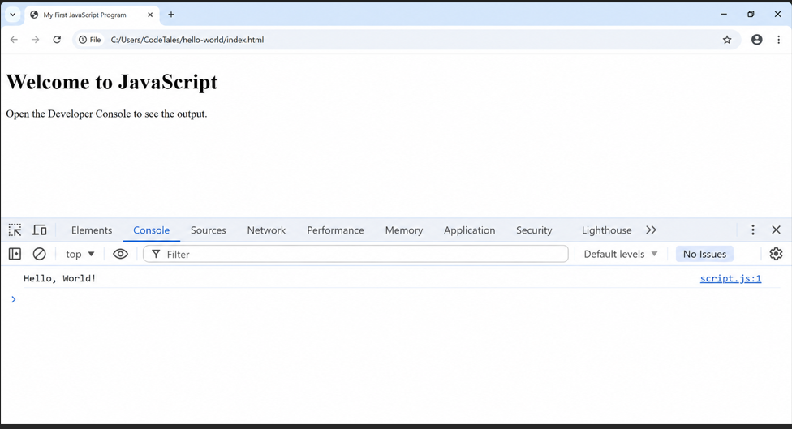

 Chapter 1

  Introduction to JavaScript

---

# Chapter Overview

JavaScript is one of the most influential programming languages ever created. It powers the interactive experiences behind modern websites, web applications, mobile applications, desktop software, cloud services, and even Internet of Things (IoT) devices. From displaying dynamic content on a webpage to controlling complex web applications used by millions of people every day, JavaScript has become an essential technology for software development.

Whether you aspire to become a frontend developer, backend engineer, full-stack developer, mobile application developer, or software architect, learning JavaScript opens the door to a vast ecosystem of technologies and career opportunities. It is one of the few programming languages that can be used across nearly every layer of modern software development.

This chapter introduces JavaScript from first principles. Rather than immediately writing code, you will first understand what JavaScript is, why it was created, how it evolved into one of the world's most popular programming languages, where it runs, and why millions of developers rely on it every day. Building this foundation will make every concept you encounter in later chapters easier to understand.

By the end of this chapter, you will have written your first JavaScript program, understood how JavaScript executes code, and gained a clear picture of the journey ahead.

---

# Learning Objectives

After completing this chapter, you should be able to:

- Define JavaScript in your own words.
- Explain the purpose of JavaScript in web development.
- Describe the history and evolution of JavaScript.
- Explain the relationship between JavaScript and ECMAScript.
- Identify the environments where JavaScript can run.
- Differentiate between JavaScript running in a browser and JavaScript running on a server.
- Understand the role of JavaScript engines.
- Write and execute your first JavaScript program.
- Explain how JavaScript code is interpreted and executed.
- Recognize common misconceptions about JavaScript.

---

# Prerequisites

This chapter assumes no previous programming experience.

However, you should be comfortable with the following:

- Using a computer
- Opening files and folders
- Installing software
- Basic web browsing
- Basic understanding of websites

Knowledge of HTML is helpful but not required. Wherever HTML is needed, the necessary concepts will be introduced.

---

# Why This Chapter Matters

Many beginners rush into writing JavaScript without first understanding what the language actually is or why it behaves the way it does. As a result, they often memorize syntax without developing true understanding.

Professional developers think differently. Before they solve problems with code, they understand the tools they are using. This chapter provides that foundation.

As you progress through this book, you will repeatedly build upon the concepts introduced here. Taking the time to understand these ideas now will make advanced topics such as asynchronous programming, object-oriented programming, modules, and browser APIs much easier to master.

Remember:

> Great programmers are not those who memorize the most syntax—they are those who understand the underlying concepts.

Throughout this book, our goal is not simply to teach you how to write JavaScript. Our goal is to help you think like a JavaScript developer.

## 1.1 What Is JavaScript?

Imagine opening your favorite website, such as YouTube, Amazon, Netflix, or Gmail. You click a button, type into a search box, watch a video without reloading the page, or receive a notification instantly. These interactive experiences are made possible largely because of JavaScript.

JavaScript is one of the world's most widely used programming languages. It brings websites to life by allowing them to respond to user actions, communicate with servers, update content dynamically, and perform complex tasks directly inside a web browser. Today, JavaScript is not limited to web browsers—it is also used to build servers, mobile applications, desktop applications, games, and even Internet of Things (IoT) devices.

Before diving into JavaScript itself, it is important to understand what a programming language is and why programming languages exist.

---

### What Is a Programming Language?

A programming language is a formal language used by humans to write instructions that a computer can execute.

Computers are incredibly fast at processing information, but they do not understand human languages such as English, French, or Arabic. Instead, they understand only machine code—a series of binary instructions consisting of zeros (0) and ones (1).

For example, a computer naturally understands instructions that resemble this:

```text
10110100
00001111
11101010
01010111
```

Although machine code is extremely efficient for computers, it is almost impossible for humans to read, write, and maintain.

Programming languages solve this problem by allowing developers to write instructions in a format that is much closer to human language. These instructions are then translated into machine code that the computer can understand.

For example, instead of writing binary instructions, a JavaScript developer can simply write:

```javascript
console.log("Hello, World!");
```

This single line of code is much easier to read and understand than thousands of binary digits.

Programming languages therefore act as a bridge between humans and computers.

---

### Why Do Computers Need Programming Languages?

Every action a computer performs follows instructions. Without instructions, a computer cannot decide what to do.

Programming languages allow developers to tell computers how to:

- Perform calculations
- Store information
- Display images
- Play videos
- Respond to user input
- Connect to the internet
- Save files
- Communicate with databases

Think of a computer as a highly intelligent worker that never makes decisions independently. It only performs the instructions it receives.

The quality of a program therefore depends largely on the quality of the instructions written by the programmer.

---

### What Exactly Is JavaScript?

JavaScript is the programming language that makes web pages interactive. It enables websites to respond to user actions, update content dynamically, validate user input, communicate with servers, and create engaging user experiences.

Technically, JavaScript is a high-level, dynamic, multi-paradigm programming language that conforms to the ECMAScript specification. It supports object-oriented, functional, and event-driven programming, making it one of the most versatile languages used in modern software development.

Unlike HTML, which defines the structure of a webpage, or CSS, which controls its appearance, JavaScript controls how a webpage behaves.

For example, JavaScript can:

- Validate form inputs before submission.
- Display pop-up messages.
- Create image sliders.
- Build interactive maps.
- Update page content without refreshing the browser.
- Play videos.
- Create games.
- Fetch information from online servers.
- Build complete web applications.

Over the years, JavaScript has evolved into a general-purpose programming language capable of powering both client-side and server-side applications.

Today, millions of developers use JavaScript every day to build software for businesses, governments, educational institutions, and startups around the world.

---

### Why Was JavaScript Created?

When the World Wide Web first became popular in the early 1990s, websites were static. They displayed information but offered very little interaction.

A webpage looked more like a digital newspaper than a modern application.

If a visitor clicked a button, submitted a form, or wanted updated information, the browser usually had to reload the entire page.

This created a poor user experience.

In 1995, Netscape Communications wanted to make websites more interactive. They tasked Brendan Eich with creating a lightweight scripting language that could run directly inside web browsers.

Remarkably, Brendan Eich designed the first version of JavaScript in just ten days.

Although the first release was simple, it transformed the web forever by allowing webpages to react instantly to user actions without constantly communicating with the server.

Today, JavaScript has become the programming language that powers modern web applications.

---

### JavaScript's Role in Web Development

Modern web development is built upon three core technologies:

| Technology | Primary Responsibility |
|------------|-------------------------|
| HTML | Defines the structure of a webpage |
| CSS | Controls the appearance and layout |
| JavaScript | Adds behavior, logic, and interactivity |

Each technology has a specific purpose.

Imagine building a house:

- HTML provides the walls, doors, windows, and roof.
- CSS paints the walls, arranges the furniture, and decorates the rooms.
- JavaScript installs automatic doors, security systems, lighting controls, and smart home features.

Together, these technologies create modern websites.

---

### HTML vs CSS vs JavaScript

Consider a login page.

HTML creates:

- Username field
- Password field
- Login button

CSS styles the page by:

- Changing colors
- Adjusting fonts
- Positioning elements
- Making the design responsive

JavaScript makes the page interactive by:

- Checking whether both fields are filled.
- Displaying helpful error messages.
- Sending login information securely to a server.
- Showing a loading animation.
- Redirecting the user after successful login.

Without JavaScript, the page would still exist—but it would feel static and much less responsive.

---

> **Figure 1.1**
>
> **How HTML, CSS, and JavaScript Work Together**
>
> Figure 1.1 illustrates how HTML provides the structure of a web page, CSS controls its presentation, and JavaScript adds behavior and interactivity. Together, these three technologies form the foundation of modern web development.

---

### Why Is JavaScript Considered a High-Level Language?

Programming languages are often classified as either low-level or high-level.

Low-level languages are very close to machine code and require programmers to manage many hardware details manually.

High-level languages provide simpler, more human-readable syntax, allowing developers to focus on solving problems rather than managing computer hardware.

JavaScript is considered a high-level language because it automatically handles many complex tasks, including:

- Memory management
- Garbage collection
- Object creation
- Dynamic typing
- Error handling mechanisms

As a result, developers can write powerful applications with relatively little code.

---

### Why Is JavaScript So Popular?

JavaScript's popularity comes from several important advantages:

- It runs in every modern web browser.
- It has a massive global community.
- It powers both frontend and backend development.
- It supports multiple programming styles.
- It has one of the largest ecosystems of libraries and frameworks.
- It continues to evolve through the ECMAScript standard.
- It is the primary language of the modern web.

These qualities make JavaScript one of the most valuable programming languages to learn.

---

### Real-World Applications of JavaScript

JavaScript powers countless applications used by millions of people every day.

Examples include:

- Video streaming platforms
- Social media websites
- Online banking systems
- E-commerce stores
- Email applications
- Interactive maps
- Online learning platforms
- Project management tools
- Real-time chat applications
- Data visualization dashboards

Whether you are shopping online, watching videos, reading news, or collaborating with colleagues, there is a high chance that JavaScript is working behind the scenes.

---

### Your First JavaScript Example

Let's write our first JavaScript program.

```javascript
console.log("Hello, World!");
```

---

### Expected Output

```text
Hello, World!
```

---

### Code Breakdown

```javascript
console.log("Hello, World!");
```

- `console` refers to the browser's developer console.
- `log()` is a method used to display information.
- `"Hello, World!"` is a string.
- The semicolon (`;`) marks the end of the statement. Although JavaScript can often insert semicolons automatically, consistently writing them improves readability and avoids edge cases.

When executed, JavaScript sends the message to the console.

---

### Common Beginner Misconceptions

Many beginners have incorrect assumptions about JavaScript.

**Misconception 1:** JavaScript and Java are the same language.

**Reality:** Despite their similar names, JavaScript and Java are completely different programming languages with different syntax, runtimes, and use cases.

---

**Misconception 2:** JavaScript only works in web browsers.

**Reality:** JavaScript also runs on servers using environments such as Node.js and can be used to build desktop applications, mobile apps, and command-line tools.

---

**Misconception 3:** JavaScript is only for beginners.

**Reality:** JavaScript is used to build enterprise-scale applications serving millions of users worldwide.

---

### Best Practices

As you begin learning JavaScript, keep these habits in mind:

- Focus on understanding concepts rather than memorizing syntax.
- Type every code example yourself instead of copying and pasting.
- Experiment with small modifications to observe how the program behaves.
- Read error messages carefully—they often point directly to the problem.
- Practice consistently. Even 30 minutes of focused coding each day can produce significant progress over time.

---

> **CodeTales Insight**
>
> Every experienced JavaScript developer once wrote their first `console.log()` statement. Mastery is built through consistent practice, curiosity, and persistence. Each concept you learn forms a foundation for the next, so take your time to understand the basics before moving forward.

---

# Reflection

Before moving to the next section, think about three websites you use regularly.

For each website, identify at least one feature that is likely powered by JavaScript.

Examples include:

- Navigation menus
- Search suggestions
- Login forms
- Shopping carts
- Image sliders
- Live notifications

This simple exercise will help you begin recognizing JavaScript in everyday web applications.

---

### Section Summary

In this section, you learned what a programming language is and why computers rely on programming languages to perform tasks. You discovered that JavaScript is a high-level programming language designed to create interactive and dynamic applications, particularly on the web. You also explored the distinct roles of HTML, CSS, and JavaScript, learned why JavaScript has become one of the most popular programming languages in the world, and wrote your very first JavaScript program.

In the next section, we will explore the reasons JavaScript was created and examine the challenges it was designed to solve during the early days of the World Wide Web.


---

# 1.2 Why Was JavaScript Created?

Imagine visiting a website in the early 1990s. You would likely see a page containing text, a few images, and perhaps some hyperlinks. If you wanted to navigate to another page, you clicked a link and waited for the entire page to reload. If you filled out a form incorrectly, you submitted it, waited for the server to process the request, and only then received an error message before starting over.

This was the reality of the early World Wide Web. Websites functioned much like digital brochures—they presented information but offered little or no interaction. Compared to today's standards, the web was static, slow, and limited.

How did the web evolve from those static pages into the highly interactive applications we use today?

The answer begins with JavaScript.

---

## The Early Web (1990–1995)

The World Wide Web was introduced in 1991 by Tim Berners-Lee as a system for sharing documents across the internet. During its early years, websites were built almost entirely with HTML.

HTML allowed developers to structure content using headings, paragraphs, lists, images, and hyperlinks. This was revolutionary at the time because people could easily publish and access information from anywhere in the world.

However, HTML was designed to describe documents—not to create interactive applications.

A typical webpage in the early 1990s could:

* Display text and images.
* Contain hyperlinks to other pages.
* Present simple forms.
* Organize information into basic layouts.

While these features were useful, they were also limiting. Users could read information, but they could not interact with the page in meaningful ways.

Every action required communication with the web server, often resulting in noticeable delays.

---

## The Problem with Static Websites

As the internet grew, users expected more than static pages. Businesses wanted websites that could respond immediately to customer actions, provide instant feedback, and create richer user experiences.

Unfortunately, early websites could not meet these expectations.

Consider a simple registration form.

A visitor enters:

* Name
* Email address
* Password

If the visitor accidentally leaves the email field empty, the browser cannot detect the mistake. Instead, the form is submitted to the server, which checks the information and sends back an error message.

The user must then wait for the page to reload before correcting the mistake.

This process was slow, frustrating, and inefficient.

Developers realized they needed a way to perform simple tasks directly inside the browser without constantly communicating with the server.

---

## The Limitations of HTML

HTML is an essential technology for the web, but it was never intended to function as a programming language.

HTML excels at defining the structure of a webpage. It can create headings, paragraphs, tables, forms, lists, images, and hyperlinks.

However, HTML cannot:

* Perform calculations.
* Make decisions.
* Store changing values.
* Respond to user actions.
* Validate form inputs.
* Update page content dynamically.
* Communicate with servers independently.

For example, HTML can create a button:

```html
<button>Submit</button>
```

The button appears on the screen, but clicking it does nothing unless another technology provides behavior.

HTML defines *what* exists on the page, not *how* it behaves.

---

## Why CSS Wasn't Enough

As websites became more visually appealing, Cascading Style Sheets (CSS) was introduced to separate presentation from content.

CSS gave developers control over:

* Colors
* Fonts
* Layouts
* Animations
* Spacing
* Responsive design

Although CSS greatly improved the appearance of websites, it still could not make webpages intelligent.

CSS cannot:

* Validate user input.
* Perform mathematical operations.
* Store application data.
* Retrieve information from servers.
* Respond to complex user interactions.

Think of building a car:

* HTML builds the frame.
* CSS paints the car and designs the interior.
* JavaScript starts the engine and allows the car to move.

Without JavaScript, a webpage may look beautiful but remains largely static.

---

## Netscape's Challenge

By the mid-1990s, the internet was growing rapidly, and Netscape Navigator had become one of the world's most popular web browsers.

Netscape wanted to make browsing faster and more interactive. Rather than sending every request to the server, they envisioned a scripting language that could execute directly within the browser.

Such a language would allow webpages to respond instantly to user actions, creating smoother and more engaging experiences.

To achieve this goal, Netscape assigned one of its engineers, Brendan Eich, the task of designing a lightweight scripting language for the browser.

---

## Brendan Eich and the Birth of JavaScript

Brendan Eich was an experienced software engineer working at Netscape Communications.

In 1995, he was asked to design a scripting language that could be integrated into Netscape Navigator.

Remarkably, Eich developed the first version of the language in approximately ten days.

Despite this short development period, the language introduced ideas that would influence web development for decades.

The first version was intentionally lightweight and easy to learn so that web developers could quickly add interactive features to their websites.

Although the language was relatively simple at launch, it laid the foundation for one of the most widely used programming languages in history.

---

## From Mocha to LiveScript to JavaScript

The language did not originally have the name JavaScript.

Its names evolved over time:

* **Mocha** – The project's original internal name during development.
* **LiveScript** – The first public name before release.
* **JavaScript** – The final name chosen shortly before launch.

The name "JavaScript" was largely a marketing decision. At the time, the Java programming language was attracting significant attention, and Netscape hoped that the similar name would help promote the new scripting language.

Despite the similarity in names, JavaScript and Java are entirely different languages with different purposes, syntax, and runtime environments.

---

## How JavaScript Changed the Web

The introduction of JavaScript transformed websites from static documents into interactive applications.

Developers could now create features such as:

* Client-side form validation
* Interactive menus
* Image galleries
* Pop-up dialogs
* Dynamic page updates
* Interactive games
* Real-time user feedback

Instead of waiting for the server to process every action, many tasks could now be handled instantly within the browser.

This significantly improved both performance and user experience.

Over time, JavaScript became the foundation of technologies such as AJAX, enabling webpages to update content without refreshing the entire page. This innovation paved the way for modern single-page applications (SPAs) used by platforms such as Gmail, Google Maps, Facebook, and many others.

---

## JavaScript Today

JavaScript has grown far beyond its original purpose.

Today, it is used to build:

* Interactive websites
* Backend servers
* Mobile applications
* Desktop software
* Progressive Web Apps (PWAs)
* Browser extensions
* Cloud services
* Internet of Things (IoT) applications
* Data visualization tools
* Artificial intelligence interfaces

It is one of the few programming languages that allows developers to work across nearly every layer of software development using a single language.

This versatility has made JavaScript one of the most valuable and widely adopted programming languages in the world.

---

## A Brief Timeline

```text
1991  →  World Wide Web introduced
1991  →  HTML released
1994  →  Netscape Navigator launched
1995  →  JavaScript created by Brendan Eich
1996  →  CSS becomes widely adopted
1997  →  ECMAScript standard published
2009  →  Node.js released
2015  →  ECMAScript 2015 (ES6) introduces major language improvements
Today →  JavaScript powers web, mobile, desktop, cloud, and IoT applications
```

---

> **Figure 1.2**
>
> **The Evolution of JavaScript**
>
> Figure 1.2 presents the major milestones in JavaScript's evolution, from the birth of the World Wide Web in 1991 to the modern JavaScript ecosystem that powers web, mobile, desktop, cloud, and IoT applications.

---

## Common Beginner Misconceptions

**Misconception 1:** JavaScript was created to replace Java.

**Reality:** JavaScript and Java were developed independently. They share similar names but are distinct languages with different design goals.

---

**Misconception 2:** JavaScript was only meant for small browser scripts.

**Reality:** Although it began as a browser scripting language, JavaScript has evolved into a full-fledged general-purpose programming language used across many platforms.

---

**Misconception 3:** JavaScript became popular overnight.

**Reality:** JavaScript has evolved continuously for decades. Its widespread adoption is the result of ongoing improvements, community support, and the growth of the web.

---

## Best Practices

As you continue learning JavaScript, keep these principles in mind:

* Learn the history of the language to better understand its design decisions.
* Focus on concepts rather than memorizing facts and dates.
* Appreciate that many modern JavaScript features were introduced to solve real-world problems.
* Stay curious—JavaScript continues to evolve, and lifelong learning is part of being a professional developer.

---

> **CodeTales Insight**
>
> JavaScript was created in just ten days to solve a specific problem: making websites interactive. Three decades later, it powers everything from small personal blogs to enterprise systems serving millions of users. Its story reminds us that even ideas born under tight deadlines can reshape an entire industry when they address genuine needs.

---

## Reflection

Think about a website or application you use every day.

Ask yourself:

- Which parts simply display information?
- Which parts respond immediately when you click, type, or scroll?
- How would that website feel if every action required the entire page to reload?

Understanding these differences will help you appreciate why JavaScript became essential to modern web development.

---

## Section Summary

In this section, you explored the origins of JavaScript and the challenges it was created to solve. You learned about the limitations of early web technologies, Netscape's vision for a more interactive web, Brendan Eich's role in creating JavaScript, and how the language evolved from a simple browser scripting tool into one of the most influential programming languages in the world.

In the next section, **"A Brief History of JavaScript,"** we will follow JavaScript's journey beyond its creation, exploring how the language matured through standardization, the introduction of ECMAScript, and the innovations that transformed it into one of the world's most influential programming languages.


Excellent. At this pace, Chapter 1 is already beginning to read like a professional technical book rather than a collection of notes.


---

# 1.3 A Brief History of JavaScript

Every technology has a story, and understanding that story often makes it easier to understand the technology itself. JavaScript is no exception.

Today, JavaScript powers billions of websites and applications. It runs inside web browsers, servers, mobile applications, desktop software, smart televisions, cloud platforms, and even Internet of Things (IoT) devices. Yet its journey began with a much simpler mission: making static web pages interactive.

Understanding JavaScript's evolution helps explain why the language behaves the way it does today, why certain features exist, and why the language continues to evolve through regular ECMAScript updates.

Today, JavaScript powers billions of websites and applications. It runs in web browsers, servers, mobile phones, desktop applications, smart televisions, and even Internet of Things (IoT) devices. However, its journey began with a much simpler goal: making web pages interactive.

Understanding this evolution helps explain why JavaScript behaves the way it does today and why the language continues to change through regular updates.

---

## The Early Web

During the early 1990s, the World Wide Web was still in its infancy. Websites consisted primarily of static HTML documents that displayed information such as text, images, and hyperlinks.

Although these websites allowed people to browse information online, they offered very little interaction. Every time a user wanted to perform an action—such as submitting a form or viewing updated information—the browser had to communicate with the server and reload the entire page.

Compared to modern web applications, early websites were slow and limited.

Developers needed a way to execute small pieces of code directly inside the user's browser without waiting for a server response.

This challenge led to the creation of JavaScript.

---

## Netscape and the Birth of JavaScript

In 1995, Netscape Communications dominated the web browser market with its browser, **Netscape Navigator**.

The company wanted to make websites more interactive by allowing web pages to respond immediately to user actions.

To achieve this, Netscape assigned software engineer **Brendan Eich** the task of creating a lightweight scripting language that could run inside the browser.

The deadline was extremely short.

Remarkably, Brendan Eich designed the first working version of the language in approximately **ten days**.

Although simple by today's standards, this new language fundamentally changed web development.

---

## The Language's Original Names

Interestingly, JavaScript was not always called JavaScript.

The language went through several names during its early development:

| Name           | Description                                 |
| -------------- | ------------------------------------------- |
| **Mocha**      | Original internal project name              |
| **LiveScript** | Name used shortly before release            |
| **JavaScript** | Official public name introduced by Netscape |

The final name, **JavaScript**, was chosen largely for marketing reasons.

At that time, the programming language **Java** was becoming extremely popular. Netscape believed that associating the new language with Java would attract developers and generate public interest.

This marketing decision created confusion that still exists today.

Despite their similar names, **Java and JavaScript are entirely different programming languages** with different syntax, design goals, and runtime environments.

---

## Standardizing the Language

As JavaScript became more widely used, different browser vendors began implementing their own versions of the language.

Unfortunately, these implementations were not always compatible.

A program that worked correctly in one browser might fail in another.

To solve this problem, the language needed a common standard.

In 1997, JavaScript was standardized by **Ecma International**, an organization responsible for developing technical standards.

The official specification became known as **ECMAScript**.

ECMAScript defines how the language should work, while browsers implement that specification in their JavaScript engines.

This standardization ensured that JavaScript could behave consistently across different browsers.

---

## The Browser Wars

During the late 1990s and early 2000s, browser vendors competed aggressively to dominate the web.

This period became known as the **Browser Wars**.
The intense competition between browser vendors encouraged rapid innovation, but it also introduced significant compatibility problems. Many browsers implemented unique JavaScript features that were unavailable elsewhere, forcing developers to write browser-specific code and making web development unnecessarily complex.

Popular browsers included:

* Netscape Navigator
* Microsoft Internet Explorer
* Opera

Each browser introduced its own features, many of which were not compatible with one another.

Developers often had to write different versions of the same code for different browsers, making web development difficult and time-consuming.

Eventually, browser vendors adopted the ECMAScript standard more consistently, greatly improving compatibility across the web.

---

## JavaScript Becomes More Powerful

For several years, JavaScript was used mainly for simple browser tasks such as:

* Form validation
* Image rollovers
* Pop-up messages
* Basic animations

As internet speeds improved and browsers became more capable, developers began building increasingly sophisticated applications.

Technologies such as AJAX allowed web pages to communicate with servers without reloading the entire page.

This innovation made applications feel faster and more responsive.

Services such as Gmail and Google Maps demonstrated that web applications could provide experiences similar to traditional desktop software.

JavaScript became the driving force behind this transformation.

---

## The Rise of Node.js

For many years, JavaScript was considered a browser-only language.

That changed in 2009 when **Node.js** was introduced.

Node.js allows JavaScript to run outside the browser, enabling developers to build:

* Web servers
* REST APIs
* Command-line tools
* Automation scripts
* Real-time applications
* Microservices

This development transformed JavaScript into a full-stack programming language.

Today, developers can build complete applications—from the user interface to the backend server—using JavaScript alone.

---

## Modern JavaScript

Modern JavaScript is far more powerful than the language created in 1995.

Every year, the ECMAScript standard introduces new features that improve the language.

Some major additions include:

* Arrow functions
* Classes
* Modules
* Promises
* Async/Await
* Template literals
* Destructuring
* Optional chaining
* Nullish coalescing

These improvements make JavaScript easier to write, easier to maintain, and more expressive.

Throughout this book, you will gradually learn each of these features in detail.

---

## JavaScript Today

Today, JavaScript is one of the most widely used programming languages in the world.

It is used to build:

* Interactive websites
* Single-page applications (SPAs)
* Backend servers
* Mobile applications
* Desktop software
* Progressive Web Apps (PWAs)
* Cloud services
* Browser extensions
* Games
* IoT applications

Millions of developers rely on JavaScript every day, and nearly every modern web browser includes a JavaScript engine by default.

Few programming languages have achieved such widespread adoption across so many different platforms.

---

> **Figure 1.3**
>
> **Timeline of JavaScript's Evolution**
>
> Figure 1.3 illustrates the major milestones in JavaScript's evolution, from its creation in 1995 through standardization with ECMAScript, the introduction of Node.js, modern ECMAScript releases, and its emergence as one of the world's most widely used programming languages.


---

## Reflection

Think about how JavaScript has evolved over time.

Ask yourself:

- Why was standardization through ECMAScript necessary?
- How might web development be different if every browser implemented JavaScript differently today?
- What advantages does Node.js provide by allowing JavaScript to run outside the browser?

Reflecting on these questions will help you appreciate why JavaScript continues to evolve and why standards play such an important role in software development.

---

## CodeTales Insight

> JavaScript's history teaches an important lesson: great technologies rarely start perfect. The first version of JavaScript was created in only ten days and had many limitations. Through continuous improvement, community collaboration, and standardization, it evolved into one of the world's most powerful programming languages. As a developer, you should adopt the same mindset—focus on continuous learning and improvement rather than trying to write perfect code from the beginning.

---

## Section Summary

In this section, you explored the history of JavaScript from its creation in 1995 to its evolution into a modern, full-stack programming language. You learned about Brendan Eich's role in developing JavaScript, the origin of its name, the importance of the ECMAScript standard, the browser wars, the introduction of Node.js, and the ongoing evolution of the language. Understanding this history provides valuable context for many of the features and design decisions you will encounter throughout the rest of this book.

---

In the next section, **"ECMAScript Explained,"** you will learn the relationship between JavaScript and ECMAScript, discover why the language follows yearly standards, and understand version names such as ES5, ES6 (ECMAScript 2015), ES2020, and newer releases. This knowledge will help you confidently navigate modern JavaScript documentation and discussions.

---

# 1.4 ECMAScript Explained

If you have spent any time reading JavaScript documentation, watching tutorials, or browsing developer forums, you have probably encountered terms such as **ECMAScript**, **ES6**, **ES2015**, **ES2020**, or **ES2024**.

At first glance, these names can be confusing. Many beginners assume they refer to different programming languages.

They do not.

Understanding the relationship between **JavaScript** and **ECMAScript** is one of the most important milestones in becoming a confident JavaScript developer. Once this relationship becomes clear, modern JavaScript documentation, tutorials, and version names will make much more sense.

---

## What Is ECMAScript?

ECMAScript is the official specification that defines how the JavaScript language should work.

Think of it as a rulebook.

Instead of being a programming language that you write directly, ECMAScript is a document that describes how JavaScript should behave.

It specifies things such as:

* The syntax of the language
* Keywords
* Variables
* Functions
* Objects
* Classes
* Modules
* Error handling
* Operators
* Built-in objects
* Language behavior

Every JavaScript engine uses this specification to implement the language consistently.

---

## Why Was ECMAScript Created?

In the mid-1990s, different web browsers implemented JavaScript differently.

For example, code that worked correctly in Netscape Navigator might behave differently in Internet Explorer.

This inconsistency created serious problems for developers.

To solve the problem, Netscape submitted JavaScript to **Ecma International**, an organization responsible for creating technology standards.

In 1997, Ecma published the first standardized version of the language.

This standard became known as **ECMAScript**.

Since then, browser vendors have worked to follow the same specification, allowing JavaScript to behave consistently across different browsers.

---

## JavaScript vs ECMAScript

One of the easiest ways to understand the relationship is through an analogy.

Imagine that an architect designs a house.

The architect produces a detailed blueprint showing exactly how the house should be built.

Different construction companies can use the same blueprint to build identical houses.

In this analogy:

* **ECMAScript** is the blueprint.
* **JavaScript engines** are the construction companies.
* **JavaScript** is the finished house.

The blueprint defines the rules.

The builders implement those rules.

Similarly, ECMAScript defines the language, while JavaScript engines implement it.
This separation between the specification and its implementation is common in software engineering. It allows multiple JavaScript engines to execute the same language while encouraging competition, innovation, and better performance.

---

### Another Analogy

Consider the rules of football.

The official FIFA Laws of the Game explain how football should be played.

Different leagues around the world follow those same rules.

The rules themselves are not football matches—they simply define how football should be played.

Likewise:

* ECMAScript defines the rules.
* JavaScript engines follow those rules when executing code.

---

## Who Maintains ECMAScript?

ECMAScript is maintained by **TC39**, a technical committee within Ecma International.

TC39 includes engineers from many leading technology companies, including:

* Google
* Microsoft
* Apple
* Mozilla
* Oracle
* Meta
* Amazon
* Shopify
* Bloomberg
* And many others

These engineers collaborate to improve JavaScript while maintaining compatibility with existing code.

---

## How New Features Are Added

JavaScript evolves continuously.

When developers identify areas where the language can be improved, proposals are submitted to TC39.

Each proposal passes through several review stages before becoming part of the ECMAScript specification.

The process helps ensure that new features are:

* Well designed
* Thoroughly tested
* Backward compatible
* Consistent with existing language features

Only after a proposal successfully completes this process is it included in a future ECMAScript release.

---

## ECMAScript Versions

Over the years, ECMAScript has introduced many improvements.

Some important releases include:

| Version        | Year   | Major Features                                                   |
| -------------- | ------ | ---------------------------------------------------------------- |
| ES1            | 1997   | First official ECMAScript specification                          |
| ES3            | 1999   | Improved language features and browser support                   |
| ES5            | 2009   | Strict Mode, JSON support, Array methods                         |
| ES6 (ES2015)   | 2015   | Classes, Arrow Functions, Template Literals, let, const, Modules |
| ES2016–Present | Annual | Continuous language improvements                                 |

The most significant update was **ECMAScript 2015**, commonly known as **ES6**.

This release modernized JavaScript and introduced many features that developers use every day.

Throughout this book, you will gradually learn these modern features.

---

## Why Is ES6 So Important?

Before ES6, JavaScript was often criticized for lacking features available in other programming languages.

ES6 introduced numerous improvements, including:

* `let`
* `const`
* Arrow functions
* Template literals
* Classes
* Modules
* Default parameters
* Destructuring
* Promises
* Enhanced object literals

These features made JavaScript more powerful, readable, and maintainable.

Many developers consider ES6 the beginning of modern JavaScript.

---

## Do Browsers Support Every ECMAScript Feature?

Not immediately.

Whenever a new ECMAScript version is released, browser vendors must update their JavaScript engines to support the new features.

Modern browsers such as:

* Google Chrome
* Mozilla Firefox
* Microsoft Edge
* Safari

are updated regularly and quickly adopt new ECMAScript features.

Older browsers, however, may not support the latest additions.

This is one reason developers sometimes use tools such as **Babel**, which converts modern JavaScript into older versions that can run in legacy browsers.

You will learn more about these tools in later chapters.

---

## Why Should Beginners Care About ECMAScript?

Understanding ECMAScript helps you:

* Read JavaScript documentation with confidence.
* Understand what terms like ES6 and ES2022 mean.
* Know why JavaScript continues to improve every year.
* Write modern JavaScript using current best practices.
* Appreciate why some older tutorials use different syntax.

Rather than memorizing version numbers, focus on learning the language features introduced by modern ECMAScript releases.

---

> **Figure 1.4**
>
> **Relationship Between ECMAScript, JavaScript Engines, and JavaScript Applications**
>
> Figure 1.4 illustrates the relationship between the ECMAScript specification, JavaScript engines such as V8, SpiderMonkey, and JavaScriptCore, and the JavaScript applications they execute. The specification defines the language, the engines implement the specification, and applications run on those engines.

---

## Reflection

After reading this section, answer the following questions:

1. What is the difference between JavaScript and ECMAScript?
2. Why was ECMAScript created?
3. What role does TC39 play in JavaScript's development?
4. Why might a new ECMAScript feature not work immediately in every browser?

If you can answer these questions confidently, you have understood one of the most misunderstood concepts in JavaScript.

---

## Common Beginner Misconceptions

### Misconception 1: ECMAScript is another programming language.

**Reality:** ECMAScript is the specification that defines how JavaScript should work.

---

### Misconception 2: ES6 replaced JavaScript.

**Reality:** ES6 is simply a major version of the ECMAScript specification. JavaScript continues to evolve through newer ECMAScript releases.

---

### Misconception 3: You must learn every ECMAScript version separately.

**Reality:** No. You simply learn modern JavaScript. As you progress, you'll naturally encounter features introduced in different ECMAScript versions.

---

## Best Practices

As you continue learning JavaScript:

* Use modern JavaScript syntax whenever possible.
* Prefer `let` and `const` over `var`.
* Follow current ECMAScript standards.
* Avoid relying on outdated tutorials that teach obsolete practices.
* Stay informed about new language features, but focus on mastering the fundamentals first.

---

> **CodeTales Insight**
>
> Technology evolves constantly, and JavaScript is no exception. The best developers are lifelong learners who embrace change without abandoning solid fundamentals. By understanding ECMAScript, you are learning not just how JavaScript works today, but also how it continues to grow and improve.

---

## Section Summary

In this section, you learned that ECMAScript is the official specification that defines how JavaScript should behave. You explored why the standard was created, how TC39 develops new language features, and why terms such as ES6 and ES2024 are commonly used. You also learned that JavaScript engines implement the ECMAScript specification, allowing developers to write code that works consistently across modern environments.

---

The next section, **1.5 Where JavaScript Runs**, will broaden the reader's perspective by explaining all the environments in which JavaScript can execute—from web browsers and servers to mobile apps, desktop applications, embedded devices, and beyond. This helps readers understand that JavaScript is no longer just a browser language.


---

# 1.5 Where JavaScript Runs

One of the biggest misconceptions among beginners is that JavaScript only runs inside a web browser.

While JavaScript was originally created to make web pages interactive, it has grown into one of the most versatile programming languages in the world. Today, JavaScript powers websites, backend servers, mobile applications, desktop software, cloud platforms, Internet of Things (IoT) devices, and even artificial intelligence interfaces.

Understanding where JavaScript runs is important because each environment provides different capabilities while using the same core language. As you progress through this book, you'll discover that learning JavaScript opens the door to building software for almost every major computing platform.

---

## What Is a JavaScript Environment?

A **JavaScript environment** is any software platform that provides everything needed to execute JavaScript code.

The JavaScript language itself defines syntax, variables, functions, objects, and other language features. However, it does not define how to display a webpage, read files from a computer, or communicate over a network.

These capabilities are provided by the environment in which JavaScript runs.

An environment typically includes:

* A JavaScript engine
* Built-in APIs
* Memory management
* Runtime services
* Security features
* Access to system resources

Different environments provide different APIs depending on their purpose.

---

## JavaScript in the Browser

The most common place where JavaScript runs is inside a web browser.

Every modern browser contains a JavaScript engine capable of executing JavaScript code.

Popular browsers include:

* Google Chrome
* Mozilla Firefox
* Microsoft Edge
* Safari
* Opera

When you visit a website, the browser downloads the HTML, CSS, and JavaScript files.

The browser then:
Behind the scenes, the browser's JavaScript engine reads your code, translates it into instructions the computer can understand, and executes it. We'll explore exactly how this process works in the next section when we study JavaScript engines.

1. Builds the webpage structure from HTML.
2. Applies styling using CSS.
3. Executes JavaScript to add behavior and interactivity.

For example, JavaScript in a browser can:

* Respond to button clicks
* Validate forms
* Display animations
* Update page content
* Play audio and video
* Store data locally
* Communicate with web servers
* Access browser APIs

Nearly every modern website relies heavily on JavaScript running inside the browser.

---

## JavaScript on the Server

For many years, JavaScript could only run inside web browsers.

Everything changed in 2009 with the introduction of **Node.js**.

Node.js allows JavaScript to execute outside the browser.

Instead of controlling webpages, JavaScript running on a server can:

* Build web servers
* Process user requests
* Connect to databases
* Authenticate users
* Generate dynamic webpages
* Build REST APIs
* Handle file uploads
* Send emails
* Manage business logic

This made JavaScript a true full-stack programming language.

Today, many organizations use JavaScript for both frontend and backend development.

---

## JavaScript in Mobile Applications

JavaScript is also widely used to build mobile applications.

Instead of learning separate programming languages for Android and iOS, developers can build applications using JavaScript and frameworks that compile or bridge to native mobile platforms.

Examples include:

* Cross-platform business applications
* Social networking apps
* Educational applications
* E-commerce apps
* Banking applications
* Productivity tools

This allows developers to write much of their code once while deploying it to multiple operating systems.

---

## JavaScript in Desktop Applications

JavaScript is not limited to websites and mobile apps.

It can also be used to build desktop software for Windows, macOS, and Linux.

Desktop applications built with JavaScript can include:

* Code editors
* Chat applications
* Music players
* Project management software
* Design tools
* Productivity applications

Many popular desktop applications are powered by JavaScript behind the scenes.

---

## JavaScript in Cloud Computing

Modern cloud services often use JavaScript to build scalable applications that serve millions of users.

Cloud-based JavaScript applications may perform tasks such as:

* Hosting websites
* Running APIs
* Processing large amounts of data
* Managing authentication
* Handling online payments
* Sending notifications
* Synchronizing information across devices

JavaScript has become one of the most widely used languages in cloud development.

---

## JavaScript in the Internet of Things (IoT)

The Internet of Things (IoT) refers to physical devices connected to the internet.

Some IoT devices can execute JavaScript.

Examples include:

* Smart home systems
* Security cameras
* Smart lighting
* Environmental sensors
* Industrial monitoring systems
* Wearable devices

JavaScript helps these devices communicate with users and cloud services.

---

## JavaScript in Artificial Intelligence

Although languages such as Python dominate AI development, JavaScript plays an increasingly important role in bringing AI applications to users.

JavaScript can be used to:

* Build AI-powered web interfaces
* Run machine learning models in the browser
* Visualize AI predictions
* Process user input
* Create intelligent chat interfaces

As AI becomes more integrated into everyday software, JavaScript continues to grow in importance.

---

## JavaScript Everywhere

The following table summarizes where JavaScript can run.

| Environment       | Common Uses                                    |
| ----------------- | ---------------------------------------------- |
| Web Browsers      | Interactive websites and web applications      |
| Servers           | APIs, backend logic, databases, authentication |
| Mobile Devices    | Android and iOS applications                   |
| Desktop Computers | Cross-platform desktop software                |
| Cloud Platforms   | Web services and scalable applications         |
| IoT Devices       | Smart devices and embedded systems             |
| AI Interfaces     | Interactive machine learning applications      |

---

> **Figure 1.5**
>
> **Where JavaScript Runs**
>
> *(Insert a hub-and-spoke diagram with "JavaScript" at the center. Surround it with icons representing a web browser, server, smartphone, desktop computer, cloud, IoT device, and AI, with arrows connecting each environment to JavaScript.)*

---

## Why This Matters

Understanding where JavaScript runs changes how you think about the language.

Many beginners believe JavaScript is "just for websites."

In reality, JavaScript is a general-purpose programming language that powers software across many industries.

This flexibility explains why JavaScript consistently ranks among the world's most popular programming languages.

Whether you want to become a frontend developer, backend engineer, full-stack developer, mobile developer, or cloud
engineer, JavaScript provides a strong foundation.

---

## Reflection

Think about the software you use every day.

For each application below, decide where JavaScript might be running.

- A shopping website
- A banking mobile app
- A desktop chat application
- A smart home device
- An AI chatbot

Although these applications look very different, many of them rely on the same JavaScript language running in different environments.

---

## Common Beginner Misconceptions

### Misconception 1: JavaScript only works inside web browsers.

**Reality:** JavaScript also runs on servers, mobile devices, desktop applications, cloud platforms, and IoT devices.

---

### Misconception 2: You need different JavaScript languages for different environments.

**Reality:** The JavaScript language remains the same. What changes is the runtime environment and the APIs available.

---

### Misconception 3: Browser JavaScript and server-side JavaScript are completely different.

**Reality:** They use the same core language. The primary difference lies in the APIs and resources each environment provides.

---

## Best Practices

As you learn JavaScript:

* Focus on mastering the language before worrying about different environments.
* Understand that every environment offers its own specialized APIs.
* Build a strong foundation in browser-based JavaScript first, as it introduces many essential concepts.
* Later, explore server-side, mobile, and desktop development to expand your skills.

---

> **CodeTales Insight**
>
> JavaScript began as a simple scripting language for web pages, but it has grown into one of the most versatile programming languages ever created. Learning JavaScript today is not just about building websites—it is about gaining the ability to create software for virtually every modern computing platform.

---

## Section Summary

In this section, you learned that JavaScript is no longer confined to web browsers. You explored the concept of JavaScript environments and discovered how the language runs in browsers, servers, mobile applications, desktop software, cloud platforms, IoT devices, and AI-powered interfaces. Understanding these environments provides a broader perspective on JavaScript's versatility and prepares you for exploring the technologies built upon it.

---

In the next section, **"JavaScript Engines,"** you'll discover what happens after you write JavaScript code. We'll explore the engines that power modern JavaScript—such as V8, SpiderMonkey, and JavaScriptCore—and learn how they parse, compile, optimize, and execute your programs. Understanding this process will give you a deeper appreciation of how JavaScript actually works behind the scenes.


Excellent. This is one of the most important conceptual sections in Chapter 1 because many beginners write JavaScript for months without ever understanding **who actually executes their code**.

This section should make that process crystal clear.

---

# 1.6 JavaScript Engines

Every time you write a JavaScript program and click **Run**, something remarkable happens behind the scenes.

Consider this simple line of code:

```javascript
console.log("Hello, World!");
```
At the lowest level, computers understand only machine language—a sequence of binary digits (0s and 1s). Writing programs directly in binary is extremely difficult because even simple instructions become long sequences of numbers that are hard to read, write, debug, and maintain.

To solve this problem, programmers use high-level programming languages such as JavaScript. These languages are designed to be readable by humans while still being translated into instructions that computers can execute.

So how does your computer execute JavaScript?

The answer is the **JavaScript engine**.

A JavaScript engine acts as a translator and executor. It reads your JavaScript code, converts it into instructions the computer understands, optimizes it for speed, and then executes it.

Without a JavaScript engine, JavaScript code would simply be text that computers could not interpret.
Although developers write JavaScript, the language is formally standardized through a specification known as **ECMAScript**. This specification defines how JavaScript should behave, ensuring that code runs consistently across modern browsers and JavaScript environments. You will learn more about ECMAScript later in this chapter.

---

## What Is a JavaScript Engine?

A **JavaScript engine** is a software program responsible for reading, compiling, optimizing, and executing JavaScript code.

Every modern browser includes its own JavaScript engine.

When you visit a website, the browser loads the JavaScript files and passes them to its engine for execution.

The engine works continuously while the webpage is open, responding to user interactions and updating the page whenever necessary.

In simple terms:

> **JavaScript Engine = The software that understands and runs JavaScript code.**

---

## Why Do We Need JavaScript Engines?

Imagine writing a letter in English to someone who only understands Chinese.

A translator would be needed to convert your English into Chinese before communication could take place.

A JavaScript engine performs a similar role.

It translates JavaScript into instructions that the computer's processor can execute.

Without the engine:

* Browsers would not understand JavaScript.
* Websites would not be interactive.
* Buttons would not respond.
* Animations would not play.
* Games would not function.
* Modern web applications would not exist.

---

## Popular JavaScript Engines

Different browsers use different JavaScript engines.

Although they all follow the ECMAScript specification, each engine has its own internal implementation and optimization techniques.

| Browser         | JavaScript Engine |
| --------------- | ----------------- |
| Google Chrome   | V8                |
| Microsoft Edge  | V8                |
| Mozilla Firefox | SpiderMonkey      |
| Safari          | JavaScriptCore    |
| Opera           | V8                |

Because all modern engines follow the ECMAScript standard, JavaScript code generally behaves consistently across browsers.

---

## The V8 JavaScript Engine

One of the most influential JavaScript engines is **V8**, developed by Google.

Introduced in 2008 for Google Chrome, V8 dramatically improved JavaScript performance.

Unlike earlier engines that interpreted code line by line, V8 introduced **Just-In-Time (JIT) compilation**, allowing JavaScript to execute much faster.

Today, V8 powers:

* Google Chrome
* Microsoft Edge
* Node.js
* Numerous developer tools

Its speed played a major role in enabling complex web applications such as Google Docs, Gmail, and modern online editors.

---

## How a JavaScript Engine Executes Code

Although JavaScript execution involves many internal processes, the overall workflow can be simplified into several stages.

### Step 1: Read the Source Code

The engine receives your JavaScript file.

For example:

```javascript
let name = "CodeTales Africa";
console.log(name);
```

At this stage, the code is simply text.

---

### Step 2: Parsing

The engine reads the code and checks whether it follows JavaScript syntax rules.

If the code contains mistakes, the engine generates a syntax error.

For example:

```javascript
console.log("Hello"
```

Because the closing parenthesis is missing, the engine cannot continue.

---

### Step 3: Building the Abstract Syntax Tree (AST)

If the code is valid, the engine converts it into an internal structure called an **Abstract Syntax Tree (AST)**.

An AST represents the logical structure of the program.

Instead of viewing the code as plain text, the engine now understands:

* Variables
* Functions
* Expressions
* Loops
* Objects
* Statements

This makes the program easier for the engine to analyze and optimize.

---

### Step 4: Compilation

Modern JavaScript engines compile the parsed code into machine instructions.

Rather than interpreting every line repeatedly, engines compile portions of the code into highly efficient machine code.

This significantly improves performance.

---

### Step 5: Optimization

Modern engines are extremely intelligent.

As your program runs, the engine identifies frequently executed code and applies advanced optimization techniques to make it faster.

Some optimizations include:

* Removing unnecessary operations
* Optimizing loops
* Improving memory usage
* Speeding up function calls

These optimizations happen automatically.

---

### Step 6: Execution

Finally, the optimized machine code is executed by the computer's processor.

At this point:

* Variables are created.
* Functions execute.
* Calculations are performed.
* Messages appear in the console.
* Webpages update.
* Buttons respond to clicks.

Everything you see happening on a webpage results from this execution process.

---

## Simplified Execution Flow

The complete process can be summarized as follows:

```
JavaScript Code
        │
        ▼
JavaScript Engine
        │
        ▼
Parsing
        │
        ▼
Abstract Syntax Tree (AST)
        │
        ▼
Compilation
        │
        ▼
Optimization
        │
        ▼
Machine Code
        │
        ▼
CPU Executes Program
```

---

> **Figure 1.6**
>
> **How a JavaScript Engine Executes Code**
>
> Figure 1.6 illustrates the journey of a JavaScript program from the moment the source code is written to the point where it is executed by the computer's CPU. The JavaScript engine first parses the source code into an Abstract Syntax Tree (AST), compiles and optimizes it, converts it into machine code, and finally executes the instructions on the processor.

---

## Do All JavaScript Engines Work the Same Way?

Not exactly.

Different engines use different internal algorithms and optimization strategies.

However, because they all implement the ECMAScript specification, developers can generally expect the same JavaScript code to produce the same results across modern browsers.

This consistency is one of the reasons JavaScript has become so reliable for cross-platform development.

---

## Why Understanding JavaScript Engines Matters

As a beginner, you do not need to understand every internal detail of a JavaScript engine.

However, knowing that an engine is responsible for executing your code helps explain many concepts you will encounter later, including:

* Performance optimization
* Memory management
* Garbage collection
* Scope
* Closures
* Execution context
* The Call Stack
* The Event Loop
* Asynchronous programming

These topics become much easier to understand when you know that a JavaScript engine is coordinating the execution of your program.

---

## Common Beginner Misconceptions

### Misconception 1: Browsers understand JavaScript directly.

**Reality:** Browsers rely on a JavaScript engine to parse, compile, optimize, and execute JavaScript code.

---

### Misconception 2: Every browser executes JavaScript in exactly the same way.

**Reality:** Different browsers use different JavaScript engines. Although their internal implementations vary, they all follow the ECMAScript specification to produce consistent behavior.

---

### Misconception 3: JavaScript is interpreted one line at a time.

**Reality:** Modern JavaScript engines use sophisticated techniques such as Just-In-Time (JIT) compilation and runtime optimization to achieve high performance.

---

## Best Practices

As you continue learning JavaScript:

* Focus on writing clear and correct code before worrying about performance.
* Understand that the JavaScript engine performs many optimizations automatically.
* Learn how the engine works conceptually, but avoid becoming overwhelmed by implementation details at this stage.
* As your skills grow, revisit topics such as execution contexts, the call stack, and the event loop with this foundational knowledge in mind.

---

> **CodeTales Insight**
>
> Great developers understand that writing code is only part of programming. Equally important is knowing how the computer executes that code. A solid understanding of JavaScript engines will help you write faster, cleaner, and more efficient programs as you advance.

---

## Section Summary

In this section, you learned that a JavaScript engine is the software responsible for executing JavaScript code. You explored why engines are necessary, examined the most popular engines used by modern browsers, and followed the journey of a JavaScript program from source code through parsing, AST creation, compilation, optimization, and execution. This knowledge lays the foundation for understanding more advanced topics such as execution contexts, the call stack, asynchronous programming, and performance optimization later in this book.

---

The next section, **1.7 JavaScript in the Browser**, will explain how JavaScript interacts with HTML and CSS, how browsers load web pages, and how the **Document Object Model (DOM)** enables JavaScript to create dynamic, interactive user experiences. This section will bridge the gap between the language itself and real-world web development.


---

# 1.7 JavaScript in the Browser

For most beginners, the web browser is the first place they encounter JavaScript. Every time you visit a modern website, your browser quietly performs hundreds of operations in just a fraction of a second. It downloads HTML, CSS, and JavaScript files, builds the webpage, and executes JavaScript to create the interactive experience you see on your screen.

The browser is much more than a program for displaying web pages. It provides a complete JavaScript environment, supplying the tools, APIs, and security mechanisms needed for JavaScript to run safely and efficiently.

When you visit a website, the browser performs several important tasks:

1. It requests the webpage from a web server.
2. It downloads the HTML document.
3. It downloads any CSS files used for styling.
4. It downloads JavaScript files.
5. It builds the webpage.
6. It executes the JavaScript code.

Without JavaScript, websites would be little more than digital documents containing text and images. JavaScript transforms them into rich, interactive applications.

---

## How JavaScript Works Inside the Browser

A browser contains several components that work together to display a webpage.

The simplified process looks like this:

```
              User Opens Website
                     │
                     ▼
             Browser Requests Page
                     │
                     ▼
      Downloads HTML, CSS, and JavaScript
                     │
                     ▼
      Browser Builds the Web Page (DOM)
                     │
                     ▼
       JavaScript Engine Executes Code
                     │
                     ▼
      Interactive Website Appears
```

Each stage in this process depends on the previous one. The browser must first download the webpage resources before it can build the Document Object Model (DOM). Only after the DOM is available can JavaScript safely interact with the page and respond to user actions.

---

> **Figure 1.7**
>
> **How JavaScript Runs Inside a Web Browser**
>
> Figure 1.7 illustrates the lifecycle of a webpage inside a browser. Beginning with the user's request, the browser downloads the HTML, CSS, and JavaScript files, constructs the Document Object Model (DOM), executes the JavaScript code using its engine, and finally presents an interactive webpage to the user.

---

## What Can JavaScript Access in the Browser?

Running inside a browser gives JavaScript access to many powerful features through browser APIs.

Some of the most commonly used browser capabilities include:

* Manipulating HTML elements
* Changing CSS styles dynamically
* Responding to mouse clicks
* Responding to keyboard input
* Playing audio and video
* Creating animations
* Accessing browser storage
* Making network requests
* Displaying notifications
* Obtaining the user's location (with permission)

These capabilities allow developers to create applications that feel responsive and interactive.

For example, JavaScript can instantly change the color of a button after it is clicked without reloading the page.

---

## The Document Object Model (DOM)

One of JavaScript's most important browser features is access to the **Document Object Model (DOM).**

The DOM is a structured representation of an HTML document. It allows JavaScript to find, read, modify, create, and remove HTML elements.

Consider the following HTML:

```html
<h1 id="title">Welcome</h1>
```

JavaScript can locate this heading and change its content.

```javascript
document.getElementById("title").textContent = "Welcome to JavaScript!";
```

After this code executes, the webpage changes from:

```
Welcome
```

to

```
Welcome to JavaScript!
```

Notice that the page updates instantly without needing to reload.

The DOM is one of the reasons JavaScript became so revolutionary. Before JavaScript, webpages were mostly static. The DOM allows developers to create pages that respond immediately to user actions.

In **Chapter 17**, you will study the DOM in detail and learn how to manipulate HTML elements using JavaScript.

---

## Responding to User Events

A webpage becomes interactive when it responds to user actions.

These actions are called **events**.

Common browser events include:

* Clicking a button
* Typing into a text field
* Moving the mouse
* Scrolling a page
* Pressing a keyboard key
* Submitting a form
* Loading a webpage

JavaScript listens for these events and executes code when they occur.

For example:

```javascript
button.addEventListener("click", function () {
  console.log("Button clicked!");
});
```

This code tells JavaScript to wait until the user clicks a button. When the click occurs, the message is displayed in the browser console.

You will learn much more about events in **Chapter 18**.

---

## Browser Developer Tools

Every modern browser includes powerful tools for developers.

These tools make it possible to:

* Inspect HTML elements
* Modify CSS temporarily
* View JavaScript errors
* Execute JavaScript code
* Monitor network requests
* Measure website performance
* Debug applications

For beginners, the **Console** is one of the most valuable tools.

You can usually open the Developer Tools by pressing:

| Operating System | Shortcut                        |
| ---------------- | ------------------------------- |
| Windows/Linux    | **F12** or **Ctrl + Shift + I** |
| macOS            | **Cmd + Option + I**            |

Inside the Console, you can experiment with JavaScript without creating a file.

For example:

```javascript
2 + 3
```

Output:

```text
5
```

Or:

```javascript
console.log("Welcome to JavaScript!");
```

Output:

```text
Welcome to JavaScript!
```

This makes the browser console an excellent environment for learning and testing small pieces of code.

---

## Browser Security

Although JavaScript is powerful, browsers place important security restrictions on what it can do.

For example, JavaScript cannot:

* Read files from your computer without permission.
* Modify files on your hard drive automatically.
* Access another website's private data.
* Install software on your computer.
* Read your passwords stored in other websites.

These restrictions protect users from malicious websites.

Browsers enforce security mechanisms such as the **Same-Origin Policy** and **sandboxing**, which prevent web pages from performing unauthorized actions.

As a JavaScript developer, understanding these security rules helps explain why some operations require explicit user permission.

---

## Real-World Example

Suppose you are shopping online.

When you click **"Add to Cart,"** JavaScript immediately:

* Updates the shopping cart.
* Increases the item count.
* Calculates the new total price.
* Displays a confirmation message.
* Updates the cart icon.

All of these changes happen instantly without refreshing the page.

This smooth experience is possible because JavaScript runs directly inside your browser.

---

## Reflection

Open your favorite website and observe how it behaves.

Ask yourself:

- Which parts of the page are created with HTML?
- Which visual elements are controlled by CSS?
- Which actions are likely handled by JavaScript?
- What changes immediately when you click a button or submit a form?

Thinking about these questions will help you recognize JavaScript in real-world web applications.

---

## Best Practices

When working with JavaScript in the browser:

* Always test your code using the browser console.
* Learn to read error messages instead of ignoring them.
* Keep your browser updated to benefit from the latest JavaScript features.
* Avoid modifying the DOM unnecessarily, as excessive changes can reduce performance.
* Use Developer Tools regularly—they are an essential part of every professional developer's workflow.

---

> **CodeTales Insight**
>
> The browser is your first JavaScript laboratory. Every experiment you perform in the Console, every DOM element you inspect, and every error you debug strengthens your understanding of how JavaScript works. Professional developers spend a significant portion of their time using browser Developer Tools—not because they make mistakes, but because these tools help them understand and improve their code.

---

## Section Summary

In this section, you learned how JavaScript executes inside a web browser and how the browser provides the environment needed for interactive web applications. You explored the role of the DOM, browser APIs, events, Developer Tools, and browser security. These concepts form the foundation of client-side JavaScript development and will be explored in much greater depth in later chapters.

In the next section, **"JavaScript Outside the Browser,"** you'll explore how the same JavaScript language runs in environments beyond the web browser. You'll discover how JavaScript powers backend servers, desktop software, mobile applications, cloud platforms, and many other modern technologies.


## 1.8 JavaScript Outside the Browser

When JavaScript was first introduced in 1995, its primary purpose was to make web pages interactive. For many years, developers associated JavaScript exclusively with web browsers. If you wanted to create a desktop application, a mobile app, or a server, you typically had to learn a different programming language.

Today, that is no longer the case.

JavaScript has evolved into a general-purpose programming language that runs in many environments beyond the browser. Thanks to modern runtime environments and frameworks, developers can use JavaScript to build web servers, desktop software, mobile applications, command-line tools, cloud services, Internet of Things (IoT) systems, and even certain artificial intelligence applications.

This evolution has made JavaScript one of the most versatile programming languages in the world.

---

## Why Did JavaScript Move Beyond the Browser?

As JavaScript became more powerful, developers recognized its potential beyond creating interactive web pages.

Many organizations wanted to use a single programming language for both the frontend and the backend of their applications. Using one language across an entire project reduces development time, simplifies collaboration, and makes it easier for developers to work across different parts of a system.

The introduction of **Node.js** in 2009 was a turning point. Node.js made it possible to execute JavaScript outside the browser, opening the door to entirely new categories of applications.

Today, JavaScript is no longer "just a browser language." It has become a language capable of powering complete software ecosystems.

---

## JavaScript on the Server with Node.js

One of the most significant developments in JavaScript's history was the creation of **Node.js**.

Node.js is a JavaScript runtime environment that allows JavaScript code to run directly on a computer's operating system instead of inside a browser.

With Node.js, JavaScript can:

* Build web servers
* Process user requests
* Connect to databases
* Read and write files
* Send emails
* Handle authentication
* Build APIs
* Perform background tasks

This means a single language can now power both the user interface and the server that supports it.

For example, when you log into an online banking application, JavaScript may be running:

* In your browser to validate your login form.
* On the server to verify your credentials.
* In the database layer to retrieve your account information.

This ability to work across multiple layers makes JavaScript extremely valuable.

---

## How Browser JavaScript and Server JavaScript Differ

Although both environments use JavaScript, they have different responsibilities.

| Browser JavaScript          | Server-Side JavaScript                       |
| --------------------------- | -------------------------------------------- |
| Runs inside a web browser   | Runs on a server using Node.js               |
| Interacts with HTML and CSS | Interacts with files, databases, and servers |
| Responds to user actions    | Processes business logic                     |
| Updates the user interface  | Sends data back to the client                |
| Uses browser APIs           | Uses Node.js APIs                            |

Think of a restaurant.

The dining area is like the browser—it is where customers interact with the business.

The kitchen is like the server—it prepares the food and sends it back to the customers.

Both areas work together to provide a complete experience.

---

## Building Desktop Applications

JavaScript can also be used to create desktop software that runs on Windows, macOS, and Linux.

Frameworks such as **Electron** allow developers to build desktop applications using familiar web technologies.

Popular desktop applications built with JavaScript include:

* Visual Studio Code
* Discord
* Slack
* Postman
* GitHub Desktop

Instead of learning a completely different language for desktop development, developers can reuse their JavaScript knowledge.

---

## Building Mobile Applications

JavaScript is widely used for mobile development.

Frameworks such as **React Native** allow developers to create Android and iOS applications using JavaScript.

Instead of maintaining separate codebases for Android and iPhone applications, developers can write much of the application once and deploy it to both platforms.

Examples of mobile applications built with JavaScript technologies include:

* Social media apps
* Food delivery apps
* Banking applications
* Shopping apps
* Educational platforms

This greatly reduces development time while maintaining high performance.

---

## Command-Line Applications

Not every application has a graphical user interface.

Many developers create tools that run directly in the terminal or command prompt.

JavaScript can be used to build command-line applications that perform tasks such as:

* Automating repetitive work
* Generating reports
* Managing projects
* Processing files
* Running development tools

In fact, many tools web developers use every day are written in JavaScript.

Examples include:

* npm
* ESLint
* Prettier
* Vite
* Create React App

You will encounter several of these tools throughout your JavaScript journey.

---

## Internet of Things (IoT)

JavaScript is increasingly used in Internet of Things (IoT) development.

IoT refers to physical devices connected to the internet that can collect, send, and receive data.

Examples include:

* Smart home systems
* Security cameras
* Smart thermostats
* Wearable devices
* Smart agriculture systems
* Environmental monitoring sensors

JavaScript allows developers to create software that controls and communicates with these devices.

Imagine using your smartphone to turn on your home's lights before arriving. JavaScript can be part of the software that makes this possible.

---

## JavaScript in Artificial Intelligence

Although languages such as Python dominate artificial intelligence research, JavaScript also plays an important role in AI applications.

JavaScript can:

* Run machine learning models in web browsers.
* Build AI-powered websites.
* Process natural language.
* Recognize images.
* Create intelligent chat interfaces.
* Perform predictive analysis.

Libraries such as TensorFlow.js allow developers to run machine learning models directly in the browser without requiring users to install additional software.

This enables AI-powered applications that run entirely on the user's device.

---

## Cloud Computing and Serverless Applications

Modern software increasingly runs in the cloud.

JavaScript is commonly used to build cloud-based services and serverless functions.

Cloud platforms allow developers to deploy JavaScript applications without managing physical servers.

These applications can:

* Process online payments
* Store customer information
* Handle file uploads
* Send notifications
* Authenticate users
* Scale automatically as demand grows

Cloud computing has become an essential part of modern software development, and JavaScript plays a major role in this ecosystem.

---

## Companies That Use JavaScript

JavaScript is trusted by organizations of every size, from startups to some of the world's largest technology companies.

Examples include:

* Google
* Microsoft
* Netflix
* Amazon
* Meta
* PayPal
* Uber
* Airbnb
* LinkedIn
* Spotify

These companies rely on JavaScript to build fast, interactive, and scalable applications that serve millions of users every day.

---

> **Figure 1.8**
>
> **Where JavaScript Runs Beyond the Browser**
>
> *(Insert a diagram showing JavaScript at the center with branches to Browser, Server (Node.js), Desktop Applications, Mobile Applications, Command-Line Tools, Cloud Services, IoT Devices, and Artificial Intelligence.)*

---

## Real-World Example

Consider a modern ride-hailing application.

JavaScript may be used in several places simultaneously:

* The customer uses a JavaScript-powered mobile application to request a ride.
* The backend server processes the request using Node.js.
* A cloud service stores ride information.
* The driver's application receives updates in real time.
* An AI system estimates arrival times.
* A dashboard displays live analytics for administrators.

Although these components perform different tasks, JavaScript can play a role in each of them.

This demonstrates why learning JavaScript provides access to a wide range of career opportunities.

---

## Best Practices

As you continue learning JavaScript:

* Understand that JavaScript is more than a browser language.
* Focus first on mastering browser-based JavaScript before exploring server-side development.
* Learn the fundamentals thoroughly before moving to frameworks and libraries.
* Build projects in different environments to broaden your experience.
* Stay curious—JavaScript continues to evolve, and new opportunities emerge regularly.

---

> **CodeTales Insight**
>
> One of JavaScript's greatest strengths is its versatility. A single language can take you from building your first interactive webpage to developing cloud services, desktop software, mobile applications, and enterprise-scale systems. Master the fundamentals first, and you'll have a strong foundation for exploring every part of the JavaScript ecosystem.

---

## Section Summary

In this section, you learned that JavaScript is no longer confined to web browsers. You explored how technologies such as Node.js allow JavaScript to run on servers, enabling developers to build complete web applications using a single language. You also discovered JavaScript's role in desktop applications, mobile development, command-line tools, cloud computing, Internet of Things devices, and artificial intelligence. This versatility is one of the main reasons JavaScript remains one of the most valuable and widely used programming languages in the world.

In the next section, **1.9 What JavaScript Can Do**, you will examine the practical capabilities of JavaScript in greater detail and discover the wide range of tasks it can perform in modern software development.


## 1.9 What JavaScript Can Do

By this point in the chapter, you have learned where JavaScript runs and how it executes. The next logical question is: **What can JavaScript actually do?**

The answer is impressive.

JavaScript is capable of building everything from simple interactive web pages to enterprise applications serving millions of users around the world. It powers online banking systems, social media platforms, e-commerce websites, cloud services, mobile applications, desktop software, and much more.

In this section, you will explore the practical capabilities of JavaScript and discover why it has become one of the world's most versatile programming languages.

---

## Making Web Pages Interactive

One of JavaScript's primary purposes is adding interactivity to web pages.

Without JavaScript, websites would be static documents that display information but cannot respond intelligently to user actions.

JavaScript allows a webpage to:

* Respond when a user clicks a button.
* Display or hide content.
* Update information instantly.
* Validate user input.
* Show animations.
* Play multimedia content.
* React to keyboard and mouse events.

For example, when you click a "Show Password" button on a login form, JavaScript changes the password field from hidden text to visible text without reloading the page.

This creates a smoother and more user-friendly experience.

---

## Manipulating Web Page Content

JavaScript can create, modify, and remove elements on a webpage.

Using the Document Object Model (DOM), JavaScript can:

* Change headings
* Modify paragraphs
* Insert new elements
* Delete existing elements
* Change images
* Update links
* Rearrange page content

Consider the following HTML:

```html
<p id="message">Welcome!</p>
```

JavaScript can update the content instantly.

```javascript
document.getElementById("message").textContent = "Welcome to CodeTales Africa!";
```

After execution, the page changes from:

```text
Welcome!
```

to

```text
Welcome to CodeTales Africa!
```

Notice that the browser does not reload the page. JavaScript updates only the affected element.

---

## Handling User Input

Almost every website collects information from users.

Examples include:

* Login forms
* Registration forms
* Search boxes
* Contact forms
* Online surveys

JavaScript processes this information before it is sent to a server.

For example, JavaScript can check whether:

* A username is empty.
* A password is long enough.
* An email address has the correct format.
* Two passwords match.
* Required fields have been completed.

Providing immediate feedback improves the user's experience and reduces unnecessary communication with the server.

---

## Performing Calculations

JavaScript is excellent at performing mathematical operations.

It can calculate:

* Shopping cart totals
* Taxes
* Discounts
* Currency conversions
* Loan repayments
* Student grades
* Scientific calculations
* Financial reports

Example:

```javascript
let price = 25000;
let quantity = 3;

let total = price * quantity;


console.log(total);
```

Output:

```text
75000
```

Although this example is simple, the same principles are used in complex financial systems and business applications.

---

## Creating Animations

Modern websites often contain smooth animations that improve usability.

JavaScript can animate:

* Buttons
* Menus
* Image sliders
* Loading indicators
* Progress bars
* Pop-up windows
* Interactive charts

For example, when a navigation menu slides into view on a mobile phone, JavaScript may control when and how that animation occurs.

Animations help users understand changes occurring on the screen and create a more engaging experience.

---

## Communicating with Servers

JavaScript allows applications to exchange information with remote servers.

This makes it possible to:

* Load new data
* Save user information
* Submit forms
* Retrieve account details
* Display weather forecasts
* Fetch news articles
* Process online payments

Instead of reloading the entire webpage, JavaScript can request only the information it needs.

This technology powers modern web applications such as Gmail, Facebook, YouTube, and online banking platforms.

You will learn how to accomplish this using the **Fetch API** in Chapter 22.

---

## Working with Data

Modern applications rely heavily on data.

JavaScript can:

* Store information
* Sort data
* Filter records
* Search collections
* Generate reports
* Convert data formats
* Process JSON
* Manipulate arrays and objects

For example, an online store may use JavaScript to sort products by:

* Price
* Popularity
* Customer rating
* Availability

This happens instantly inside the browser.

---

## Storing Information

JavaScript can store information directly inside the user's browser.

Examples include:

* User preferences
* Shopping cart contents
* Theme settings
* Language preferences
* Recently viewed products

Even after the browser is closed, some information can remain available for future visits.

You will learn about browser storage in **Chapter 20**.

---

## Creating Games

JavaScript is widely used in game development.

Developers build games such as:

* Puzzle games
* Card games
* Platform games
* Multiplayer games
* Educational games

JavaScript handles:

* Player movement
* Scoring
* Collision detection
* Animations
* Sound effects
* Game logic

Many browser-based games are written almost entirely in JavaScript.

---

## Building Complete Applications

JavaScript is no longer limited to small scripts.

Today it powers complete software systems, including:

* Social media platforms
* Online banking applications
* Video streaming services
* E-commerce websites
* Learning management systems
* Project management software
* Customer relationship management (CRM) systems

Large development teams use JavaScript to build applications that serve millions of users around the world.

---

## Automating Tasks

JavaScript can automate repetitive tasks.

Developers use it to:

* Rename files
* Process documents
* Generate reports
* Build software automatically
* Test applications
* Deploy websites

Automation saves time, reduces errors, and improves productivity.

---

## Powering Modern Frameworks

Many popular frameworks and libraries are built on JavaScript.

Examples include:

* **React** – Building interactive user interfaces.
* **Angular** – Developing large-scale web applications.
* **Vue** – Creating lightweight and flexible user interfaces.
* **Next.js** – Building production-ready React applications.
* **Express.js** – Developing backend web servers and APIs.
* **NestJS** – Creating scalable server-side applications.
* **Electron** – Building desktop applications with JavaScript.
* **React Native** – Developing cross-platform mobile applications.

Although you do not need these frameworks to learn JavaScript, mastering the language makes learning them much easier.

---

> **Figure 1.9**
>
> **Major Capabilities of JavaScript**
>
> Figure 1.9 illustrates the broad range of software that can be built with JavaScript. From web browsers and backend servers to mobile applications, desktop software, cloud platforms, games, IoT devices, and AI interfaces, JavaScript has become one of the most versatile programming languages in modern computing.

---

## Real-World Example

Imagine ordering food through a delivery application.

JavaScript is involved in almost every step:

* Displaying available restaurants.
* Searching for meals.
* Filtering results.
* Adding food to the cart.
* Calculating delivery fees.
* Processing discounts.
* Tracking the driver's location.
* Displaying estimated delivery time.
* Updating order status in real time.

From the moment you open the application until your food arrives, JavaScript helps deliver a smooth and interactive experience.

---

## Reflection

Think about five applications you use every day.

For each one, ask yourself:

- Does it use JavaScript in the browser?
- Does it communicate with a JavaScript server?
- Does it perform calculations?
- Does it update information in real time?
- Could JavaScript be responsible for some of its interactive features?

You may be surprised by how many modern applications depend on JavaScript in one way or another.

---

## Best Practices

As you learn JavaScript:

* Focus on understanding concepts before learning frameworks.
* Build small projects to apply each new topic.
* Practice regularly to strengthen your problem-solving skills.
* Learn how different JavaScript features work together.
* Remember that JavaScript is a tool for solving real-world problems, not just writing code.

---

> **CodeTales Insight**
>
> JavaScript is not valuable because of the syntax you memorize—it is valuable because of the problems it enables you to solve. Whether you are creating a simple calculator, an online marketplace, or a global social network, the same JavaScript fundamentals provide the building blocks. Master these fundamentals, and you will be prepared to create software that makes a real impact.

---

## Section Summary

In this section, you explored the wide range of tasks JavaScript can perform. You learned how it creates interactive web pages, manipulates content, handles user input, performs calculations, communicates with servers, stores data, builds games, automates tasks, and powers complete software applications. These capabilities demonstrate why JavaScript is considered one of the most versatile programming languages in modern software development.

In the next section, **"What JavaScript Cannot Do,"** you'll discover that, despite its versatility, JavaScript has important limitations. Understanding these boundaries is just as valuable as understanding its strengths because professional developers choose technologies based on both what they can and cannot do.

## 1.10 What JavaScript Cannot Do

After exploring what JavaScript can do, it's equally important to understand what it cannot do.

Every programming language has strengths and limitations. These limitations are not necessarily weaknesses—they are often intentional design decisions made to improve security, reliability, and performance.

JavaScript is an excellent example. Although it powers billions of applications worldwide, it operates within carefully defined boundaries, especially when running inside a web browser. Understanding these boundaries will help you become a more knowledgeable and responsible developer.

## Why Does JavaScript Have Limitations?

JavaScript was designed to execute code safely on users' devices.

Imagine visiting an unfamiliar website. If that website's JavaScript code had unrestricted access to your computer, it could:

* Read your personal documents.
* Delete important files.
* Install malicious software.
* Access your saved passwords.
* Spy on your activities.

Clearly, this would be dangerous.

To protect users, web browsers enforce strict security rules that limit what JavaScript can access and control.

These restrictions are not weaknesses—they are essential security features.
Think of a browser as a secure apartment building. Every website runs inside its own locked apartment. It can use everything inside that apartment, but it cannot walk into another apartment or access the building's control room. This isolation protects both users and other websites.

---

## JavaScript Cannot Directly Access Files on Your Computer

One common misconception is that JavaScript can freely read any file stored on your computer.

This is **not true**.

Browser-based JavaScript cannot:

* Open documents from your computer without your permission.
* Read files stored in your Downloads folder.
* Browse through your hard drive.
* Delete personal files.
* Modify system files.

If a website needs access to one of your files—for example, when uploading a profile picture—you must explicitly select the file yourself.

Example:

When you click the **Choose File** button on a webpage, you are granting JavaScript permission to access only the file you selected.

Without your permission, JavaScript cannot access it.

---

## JavaScript Cannot Install Software

Websites cannot secretly install software on your computer using JavaScript.

For example, JavaScript cannot:

* Install applications.
* Install games.
* Install drivers.
* Install viruses through browser permissions alone.
* Change your operating system settings.

Modern browsers prevent these actions to protect users.

If software installation is required, the browser asks for your explicit confirmation or downloads an installation file that you must execute manually.

---

## JavaScript Cannot Access Other Websites' Data

Imagine you are logged into your online banking account.

At the same time, you open a completely different website.

Without browser security, that second website could steal your banking information.

Fortunately, browsers prevent this.

JavaScript running on one website generally cannot:

* Read another website's data.
* Access another website's cookies.
* View another website's local storage.
* Interact with another website's private information.

This protection is enforced by a security mechanism called the **Same-Origin Policy**.

The Same-Origin Policy is one of the most important security principles on the web.

---

## JavaScript Cannot Read Your Saved Passwords

Modern browsers often save usernames and passwords for convenience.

However, JavaScript cannot access these saved credentials.

For example, JavaScript cannot:

* Display your saved passwords.
* Copy passwords stored by the browser.
* Send stored passwords to another server.

Only the browser itself manages this sensitive information.

---

## JavaScript Cannot Control Your Operating System

Browser-based JavaScript does not have administrative control over your computer.

It cannot:

* Shut down your computer.
* Restart your computer.
* Format your hard drive.
* Change system settings.
* Modify registry entries.
* Manage user accounts.

These operations require operating system permissions that browsers do not grant to websites.

---

## JavaScript Cannot Bypass User Permissions

Many browser features require explicit user approval.

Examples include:

* Accessing the webcam.
* Accessing the microphone.
* Reading the user's location.
* Sending notifications.
* Accessing Bluetooth devices.

When JavaScript requests these permissions, the browser asks the user to approve or deny the request.

Example:

```
This website wants to access your location.

Allow    Block
```

Without your permission, JavaScript cannot proceed.

---

## JavaScript Cannot Replace Every Programming Language

Although JavaScript is extremely versatile, it is not always the best choice for every task.

Some specialized areas often rely on other programming languages.

For example:

| Field                            | Common Languages      |
| -------------------------------- | --------------------- |
| Operating Systems                | C, C++                |
| Artificial Intelligence Research | Python                |
| Embedded Systems                 | C                     |
| Scientific Computing             | Python, MATLAB, Julia |
| High-Performance Graphics        | C++, Rust             |

This does not mean JavaScript cannot contribute to these areas. It simply means other languages may be better suited for specific requirements.

Professional software development often involves multiple programming languages working together.

---

## Browser JavaScript vs Node.js

Many of the limitations discussed above apply specifically to JavaScript running inside a web browser.

When JavaScript runs using **Node.js**, it has greater access to the operating system.

For example, Node.js applications can:

* Read files.
* Write files.
* Create folders.
* Delete files.
* Access databases.
* Manage servers.
* Communicate with hardware.

However, Node.js applications still require appropriate operating system permissions and should be developed responsibly.

This distinction highlights the importance of understanding the environment in which your JavaScript code executes.
In other words, JavaScript itself does not determine what your code is allowed to do. The runtime environment—whether it is a web browser or Node.js—defines the APIs and system resources available to your program.

---

## Security Is a Feature, Not a Limitation

At first glance, these restrictions may seem inconvenient.

However, they exist to protect users.

Imagine if every website you visited could:

* Read your family photos.
* Delete your documents.
* Install unwanted software.
* Access your online banking account.

The internet would become an unsafe place.

By limiting what JavaScript can do, browsers create a secure environment where users can browse the web with greater confidence.

As developers, we should appreciate these protections rather than view them as obstacles.

---

> **Figure 1.10**
>
> **Browser Security Sandbox**
>
> Figure 1.10 illustrates the browser security sandbox. JavaScript runs inside a protected environment that prevents unauthorized access to the user's files, passwords, operating system resources, and data belonging to other websites. These restrictions help keep the web secure.

---

## Real-World Example

Imagine you visit an online photo editing website.

The website asks you to upload an image.

You click the **Choose File** button and select a photo.

JavaScript can now process that specific image because you granted permission.

However, it still cannot:

* Open your Documents folder.
* View your Downloads folder.
* Read other images on your computer.
* Access your private files.

This demonstrates how browsers provide controlled access while protecting your privacy.
---

## Reflection

Imagine that browser JavaScript had no security restrictions.

Consider the following questions:

- What could happen if any website could read every file on your computer?
- What risks would exist if websites could install software automatically?
- How would online banking or email accounts be affected if websites could freely access each other's data?

Reflecting on these questions helps explain why browser security is one of the most important foundations of the modern web.

---

## Best Practices

As you continue learning JavaScript:

* Understand that browser security restrictions protect users.
* Never attempt to bypass browser security mechanisms.
* Request permissions only when they are genuinely needed.
* Respect user privacy when developing web applications.
* Learn the differences between browser JavaScript and server-side JavaScript.

Building secure applications is one of the responsibilities of every professional developer.

---

> **CodeTales Insight**
>
> Great developers do not judge a language only by what it can do—they also understand why it cannot do certain things. JavaScript's security restrictions are a major reason the modern web is as safe and reliable as it is today. By respecting these boundaries, you build applications that users can trust.

---

## Section Summary

In this section, you learned that JavaScript has important limitations, particularly when running inside a web browser. You discovered that it cannot freely access files, install software, control the operating system, read passwords, or bypass user permissions. These restrictions exist to protect users and maintain a secure browsing environment. You also learned that JavaScript running in Node.js has different capabilities because it operates outside the browser.

In the next section, **"Why Learn JavaScript Today?"**, you'll discover why JavaScript continues to be one of the most valuable programming languages in the software industry. We'll explore its demand in the job market, its versatility across different platforms, and the career opportunities available to developers who master its fundamentals.


## 1.11 Why Learn JavaScript Today?

Technology has transformed nearly every aspect of modern life. Whether you are ordering food, watching videos, studying online, managing your finances, or communicating with friends, software plays a central role—and JavaScript is one of the technologies powering much of that experience.

If you want to build software, solve real-world problems, or pursue a career in technology, JavaScript is one of the best languages you can learn. Its versatility, widespread adoption, and vibrant ecosystem make it an excellent choice for beginners while remaining powerful enough for professional developers.

In this section, you'll discover why JavaScript continues to be one of the world's most valuable programming languages and why investing time in mastering its fundamentals is one of the smartest decisions you can make.

---

## JavaScript Powers the Modern Web

Every modern website relies on JavaScript in some way.

Whether you are:

* Watching videos on YouTube
* Shopping on Amazon
* Searching on Google
* Reading news online
* Booking flights
* Managing online banking
* Using social media

JavaScript is likely working behind the scenes.

It enables websites to respond instantly to user actions, display dynamic content, communicate with servers, and provide smooth, interactive experiences.

Without JavaScript, today's web would be far less engaging and functional.

---

## One Language, Many Possibilities

One of JavaScript's greatest strengths is that a single language can be used across many different platforms.

With JavaScript, you can build:

* Interactive websites
* Web applications
* Backend servers
* REST APIs
* Desktop applications
* Mobile applications
* Browser extensions
* Command-line tools
* Cloud applications
* Internet of Things (IoT) systems

Learning one language gives you access to numerous areas of software development.

This flexibility allows developers to explore different career paths without having to start over with a completely new programming language.

---

## Strong Demand in the Job Market

JavaScript has consistently ranked among the world's most in-demand programming languages.

Companies of all sizes—from startups to multinational corporations—hire JavaScript developers to build and maintain their software.

Common job roles include:

* Frontend Developer
* Backend Developer
* Full-Stack Developer
* Mobile Application Developer
* Software Engineer
* Web Application Developer
* UI Developer
* JavaScript Engineer

Because JavaScript is used across so many industries, skilled developers have opportunities to work in finance, healthcare, education, e-commerce, entertainment, logistics, and many other sectors.
The demand for JavaScript developers extends beyond traditional technology companies. Banks, hospitals, universities, government agencies, retailers, and media organizations all rely on JavaScript to build and maintain their digital services.

---

## A Large and Supportive Community

Learning a programming language is much easier when there is a strong community to support you.

JavaScript has one of the largest developer communities in the world.

This means you can find:

* Tutorials
* Documentation
* Open-source projects
* Forums
* Videos
* Books
* Online courses
* Community events
* Technical blogs

If you encounter a problem while learning, chances are that someone else has faced the same challenge and shared a solution.

A vibrant community also means the language continues to improve through collaboration and innovation.

---

## A Rich Ecosystem of Tools

JavaScript offers an extensive ecosystem of tools, libraries, and frameworks that help developers build applications more efficiently.

Popular technologies include:

* React
* Angular
* Vue.js
* Next.js
* Node.js
* Express.js
* React Native
* Electron

These technologies are built on JavaScript fundamentals.

Once you understand the language itself, learning these tools becomes much easier.

Remember, frameworks may change over time, but strong JavaScript fundamentals remain valuable throughout your career.

---

## Excellent for Beginners

JavaScript is often recommended as a first programming language because:

* Its syntax is relatively easy to read.
* You can begin writing code with only a web browser.
* Results appear immediately.
* It provides quick visual feedback.
* There are countless learning resources available.

As your skills grow, JavaScript continues to offer advanced concepts such as asynchronous programming, object-oriented programming, functional programming, and software architecture.

This makes it a language that grows with you throughout your career.

---

## JavaScript Encourages Problem Solving

Programming is not just about writing code—it is about solving problems.

As you learn JavaScript, you will develop valuable skills such as:

* Logical thinking
* Analytical reasoning
* Breaking complex problems into smaller tasks
* Debugging
* Designing efficient solutions
* Writing maintainable code

These skills are valuable far beyond software development and can benefit many other professions.

---

## Opportunities for Freelancing and Entrepreneurship

JavaScript can also help you create your own opportunities.

Many developers use JavaScript to:

* Build websites for clients
* Develop custom business applications
* Create online stores
* Launch software-as-a-service (SaaS) products
* Build educational platforms
* Develop digital tools
* Create startup companies

Rather than only seeking employment, JavaScript gives you the ability to build products and businesses that solve real-world problems.

---

## Continuous Growth and Innovation

Technology evolves rapidly, and JavaScript evolves with it.

Each new edition of the ECMAScript standard introduces improvements that make the language:

* More powerful
* Easier to read
* More efficient
* Better suited for modern software development

This continuous evolution ensures that JavaScript remains relevant as new technologies emerge.

As a JavaScript developer, lifelong learning becomes part of your professional journey.

---

## Career Paths After Learning JavaScript

Mastering JavaScript opens the door to many exciting career paths.

Examples include:

* Frontend Development
* Backend Development
* Full-Stack Development
* Mobile Development
* Desktop Application Development
* DevOps Engineering
* Cloud Computing
* Technical Consulting
* Software Architecture
* Technical Education

Your interests and goals will determine which path you choose, but a solid understanding of JavaScript provides an excellent foundation for all of them.

---

> **Figure 1.11**
>
> **Career Opportunities with JavaScript**
>
> Figure 1.11 illustrates the diverse career opportunities available to JavaScript developers. From frontend and backend development to mobile applications, cloud computing, DevOps, AI integration, and entrepreneurship, JavaScript provides a foundation for many exciting paths in modern software development.

---

## Real-World Example

Imagine a university student who learns JavaScript during their first year.

At first, they build simple projects such as a calculator, a to-do list, and a weather application.

Later, they learn backend development using Node.js and begin creating complete web applications.

Eventually, they build a portfolio, contribute to open-source projects, secure freelance clients, and later accept a full-time software engineering position.

Their journey began with learning the JavaScript fundamentals.

This example illustrates how mastering the basics can create opportunities for continuous growth and professional success.

---

## Best Practices

As you begin your JavaScript journey:

* Focus on understanding concepts rather than memorizing code.
* Practice consistently, even if only for a short time each day.
* Build projects that solve real problems.
* Learn from mistakes and view errors as learning opportunities.
* Continue improving your skills through reading, experimentation, and collaboration.

Remember, becoming a skilled developer is a marathon, not a sprint.

---

> **CodeTales Insight**
>
> Learning JavaScript is about more than acquiring a technical skill—it is about developing the ability to create solutions that improve people's lives. Every application you build begins with the same fundamentals you are learning now. Stay consistent, remain curious, and trust the learning process. Small daily improvements eventually lead to extraordinary results.

---

## Section Summary

In this section, you discovered why JavaScript remains one of the most valuable programming languages to learn. Its ability to power websites, servers, mobile applications, desktop software, and cloud services makes it an exceptionally versatile tool. You also explored the strong demand for JavaScript developers, the benefits of its large community, and the many career opportunities available to those who master it.

In the next section, **"Your First JavaScript Program,"** you'll take your first practical step into programming by writing and running your first JavaScript code. The concepts you've learned throughout this chapter will begin to come together as you transition from understanding JavaScript to actively using it.

---

# 1.12 Your First JavaScript Program

One of the most exciting moments in learning any programming language is writing your first program. Although it may seem simple, this milestone marks the beginning of your journey as a software developer.

Traditionally, the first program written in a new programming language displays the message **"Hello, World!"**. This tradition dates back several decades and has become a standard way of verifying that a programming environment is correctly configured.

In this section, you will write your first JavaScript program and learn how to execute it.

---

## Preparing Your Environment

Before writing JavaScript code, ensure that you have access to one of the following:

* A modern web browser (Google Chrome, Microsoft Edge, Mozilla Firefox, Safari, or Opera)
* A code editor such as Visual Studio Code
* Access to the browser's Developer Tools

For this book, we recommend using:

* **Visual Studio Code** as your code editor.
* **Google Chrome** as your web browser.

If you have not yet installed these tools, refer to **Chapter 2: Development Environment**, where the installation process is covered in detail.

For now, you can follow along using the browser's Developer Console.

---

## Method 1: Using the Browser Console

Every modern web browser includes a built-in JavaScript console where you can execute JavaScript code instantly.

To open the Developer Console:

### Google Chrome

* Press **F12**, or
* Press **Ctrl + Shift + J** (Windows/Linux), or
* Press **Cmd + Option + J** (macOS)

### Microsoft Edge

* Press **F12**, or
* Press **Ctrl + Shift + J**

### Mozilla Firefox

* Press **F12**
* Select the **Console** tab.

A console window should appear.

---

> **Figure 1.12**
>
> **Opening the Browser Developer Console**
>
> 

---

Inside the console, type the following code:

```javascript
console.log("Hello, World!");
```

Press **Enter**.

You should immediately see:

```text
Hello, World!

Understanding the Program

Let's examine the code one part at a time.

console.log("Hello, World!");
console refers to the browser's built-in developer console.
log() is a function that displays information in the console.
"Hello, World!" is a string (a sequence of characters enclosed in quotation marks).
The semicolon (;) marks the end of the statement. Although JavaScript can often insert semicolons automatically, explicitly writing them is a good habit for beginners.

This single line demonstrates one of the most important ideas in programming: writing instructions that the computer can execute.
```

Congratulations!

You have just executed your first JavaScript program.

---

## Method 2: Running JavaScript in an HTML File

Although the browser console is excellent for experimentation, professional developers usually write JavaScript inside files.

Create a new folder named:

```
hello-world
```

Inside the folder, create a file named:

```
index.html
```

Add the following code:

```html
<!DOCTYPE html>
<html lang="en">
<head>
    <meta charset="UTF-8">
    <meta name="viewport" content="width=device-width, initial-scale=1.0">
    <title>My First JavaScript Program</title>
</head>
<body>

    <h1>Welcome to JavaScript</h1>

    <script>
        console.log("Hello, World!");
    </script>

</body>
</html>
```

Save the file.

Open it using your web browser.

Although the webpage displays only the heading:

```
Welcome to JavaScript
```

the JavaScript code has also executed behind the scenes.

To see the output, open the browser's Developer Console.

You should again see:

```text
Hello, World!
```

---

## Method 3: Using an External JavaScript File

As programs become larger, placing JavaScript directly inside HTML files becomes difficult to manage.

Instead, developers usually store JavaScript in separate files.

Create another file inside the same folder:

```
script.js
```

Add the following code:

```javascript
console.log("Hello, World!");
```

Now update your HTML file:

```html
<!DOCTYPE html>
<html lang="en">
<head>
    <meta charset="UTF-8">
    <meta name="viewport" content="width=device-width, initial-scale=1.0">
    <title>External JavaScript</title>
</head>
<body>

    <h1>JavaScript Fundamentals</h1>

    <script src="script.js"></script>

</body>
</html>
```

Save both files.

Refresh your browser.

Open the Developer Console.

The output remains:

```text
Hello, World!
```

This is the approach you will use throughout the rest of this book.

Using external JavaScript files offers several advantages:

It keeps HTML and JavaScript separate, making code easier to read.
The same JavaScript file can be reused across multiple web pages.
Large projects become easier to organize and maintain.
Browsers can cache external JavaScript files, improving website performance.

For these reasons, professional developers almost always place their JavaScript code in separate .js files rather than embedding large amounts of code directly in HTML.

---

## Why "Hello, World?"

You might wonder why nearly every programming book begins with the same example.

The purpose is not to build a useful application.

Instead, it confirms that:

* Your programming environment is working.
* Your browser can execute JavaScript.
* You understand how to run code.
* You are ready to begin learning the language.

Think of it as introducing yourself to JavaScript.

---

## Experimenting with Your Program

One of the best ways to learn programming is through experimentation.

Try changing the message.

Example:

```javascript
console.log("Welcome to JavaScript Fundamentals!");
```

Or:

```javascript
console.log("I am learning JavaScript.");
```

Or:

```javascript
console.log("CodeTales Africa");
```

Each time you change the text and run the program again, JavaScript displays the new message.

Small experiments like these help reinforce your understanding.

---

## Common Beginner Mistakes

As you write your first program, you may encounter errors.

Here are some common mistakes:

### Missing Quotation Marks

Incorrect:

```javascript
console.log(Hello, World!);
```

Correct:

```javascript
console.log("Hello, World!");
```

---

### Misspelling `console`

Incorrect:

```javascript
consol.log("Hello");
```

Correct:

```javascript
console.log("Hello");
```

JavaScript is case-sensitive, so every character matters.

---

### Forgetting Parentheses

Incorrect:

```javascript
console.log;
```

Correct:

```javascript
console.log("Hello");
```

Functions must be called using parentheses.

---

### Editing Without Saving

Using external JavaScript files offers several advantages:

It keeps HTML and JavaScript separate, making code easier to read.
The same JavaScript file can be reused across multiple web pages.
Large projects become easier to organize and maintain.
Browsers can cache external JavaScript files, improving website performance.

For these reasons, professional developers almost always place their JavaScript code in separate .js files rather than embedding large amounts of code directly in HTML.

Always save your file before refreshing the browser.

Unsaved changes will not appear when the page reloads.
---

## Reflection

Think about your own goals.

Ask yourself:

- Why do I want to learn JavaScript?
- Which type of software would I like to build?
- Which career path interests me most?
- What small project could I build after finishing this book?

Having clear goals will help keep you motivated as you continue your learning journey.

---

## Best Practices

As you continue learning JavaScript, develop these professional habits from the very beginning:

* Write your code instead of copying and pasting whenever possible.
* Save your files frequently.
* Test your code after making small changes.
* Read error messages carefully before searching for solutions.
* Keep your code neat and properly indented.
* Practice regularly rather than studying only occasionally.

Building these habits early will make you a more productive and confident developer.

---

> **CodeTales Insight**
>
> Every professional software developer began exactly where you are now—with a simple "Hello, World!" program. Do not underestimate this moment. Every advanced application, from social media platforms to artificial intelligence systems, begins with simple lines of code. Focus on mastering the fundamentals one step at a time, and your skills will grow steadily with practice.

---
Looking Ahead

Congratulations! You have written your first JavaScript program. While it may seem simple, every professional JavaScript application—from calculators and portfolio websites to enterprise systems—starts with instructions just like these.

As you continue through this book, each new concept will build on this foundation. The small programs you write today will eventually grow into complete, real-world applications.

## Section Summary

In this section, you wrote your first JavaScript program using the browser's Developer Console. You also learned how to run JavaScript inside an HTML document and from an external JavaScript file, which is the standard approach used in professional web development. Finally, you explored common beginner mistakes and learned best practices that will help you build good programming habits from the start.

In the next section, you will explore **how JavaScript executes your code**, following the journey from the moment you write a program until the computer carries out each instruction. This understanding will give you deeper insight into how JavaScript works behind the scenes.

---

# 1.13 Understanding the Program

Writing your first JavaScript program is an important milestone, but understanding *why* it works is even more important.

Programming is not about memorizing code—it is about understanding what each instruction tells the computer to do. Every symbol, word, and punctuation mark in a JavaScript program has a purpose.

Let's revisit the program you wrote in the previous section.

```javascript
console.log("Hello, World!");
```

Although this program contains only one line of code, it introduces several fundamental concepts that you will encounter throughout your JavaScript journey.

---

## Breaking Down the Statement

Let's examine the statement piece by piece.

```javascript
console.log("Hello, World!");
```

It consists of four important components:

* `console`
* `.`
* `log()`
* `"Hello, World!"`

Each component plays a different role.

---

## The `console` Object

The word `console` refers to a built-in JavaScript object provided by the browser (and by environments such as Node.js).

Think of the console as a communication window between your program and the developer.

Instead of displaying information directly on the webpage, JavaScript can send information to the console.

Developers use the console to:

* Display messages
* Test code
* Inspect variables
* Find errors
* Debug applications

You will use the console extensively while learning JavaScript.

---

## The Dot (`.`) Operator

Notice the period between `console` and `log`.

```javascript
console.log(...)
```

This period is called the **dot operator**.

It tells JavaScript to access something that belongs to an object.

In this example:

* `console` is the object.
* `log` is one of its methods.

Later in this book, you will see many examples such as:

```javascript
document.getElementById()
```

```javascript
Math.random()
```

```javascript
Array.push()
```

All of these use the same dot notation.

---

## The `log()` Method

The `log()` method tells JavaScript to display information inside the console.

For example:

```javascript
console.log("JavaScript");
```

Output:

```text
JavaScript
```

Another example:

```javascript
console.log("Welcome to CodeTales Africa");
```

Output:

```text
Welcome to CodeTales Africa
```

The `log()` method is one of the most frequently used tools during software development because it allows developers to inspect the values produced by their programs.

---

## Understanding Parentheses

Notice that `log` is followed by parentheses.

```javascript
log()
```

The parentheses indicate that `log` is being **called** or **executed**.

Anything placed inside the parentheses becomes input for the method.

For example:

```javascript
console.log("JavaScript");
```

The text inside the parentheses is passed to the `log()` method, which then displays it in the console.

You can think of parentheses as containers that hold information being sent to a function or method.

---

## Understanding Strings

Inside the parentheses, we wrote:

```javascript
"Hello, World!"
```

This is called a **string**.

A string is a sequence of characters enclosed in quotation marks.

Strings can contain:

* Letters
* Numbers
* Spaces
* Symbols
* Punctuation

Examples:

```javascript
"JavaScript"
```

```javascript
"I love programming."
```

```javascript
"2026"
```

```javascript
"Welcome to CodeTales Africa"
```

Everything between the quotation marks is treated as text.

---

## Why Are Quotation Marks Necessary?

Quotation marks tell JavaScript that the enclosed content is text rather than a variable or command.

Consider the following:

Correct:

```javascript
console.log("Hello");
```

Incorrect:

```javascript
console.log(Hello);
```

Without quotation marks, JavaScript assumes that `Hello` is the name of a variable.

Since no variable named `Hello` exists, JavaScript produces an error.

Whenever you want to display plain text, remember to place it inside quotation marks.

---

## The Semicolon (`;`)

At the end of the statement, you will notice a semicolon.

```javascript
console.log("Hello, World!");
```

The semicolon marks the end of a JavaScript statement.

Modern JavaScript can often insert semicolons automatically through a feature known as **Automatic Semicolon Insertion (ASI)**.

Although JavaScript may work without them in many situations, professional developers often include semicolons because they:

* Improve readability.
* Make code more consistent.
* Prevent certain edge-case errors.
* Follow many professional style guides.

Throughout this book, we will consistently use semicolons.

---

## Reading the Statement Like a Computer

When JavaScript encounters the following line:

```javascript
console.log("Hello, World!");
```

it processes it in roughly this order:

1. Find the `console` object.
2. Access its `log()` method.
3. Pass the string `"Hello, World!"` to the method.
4. Display the message in the Developer Console.
5. Continue to the next instruction.

Although this happens almost instantly, understanding these steps helps you appreciate how JavaScript executes code.

---

## A Real-World Analogy

Imagine speaking into a microphone.

* The **microphone** is the `console`.
* The **Speak** button is the `log()` method.
* The **message** you say is the string.
* The **audience** receives the message.

Similarly:

```javascript
console.log("Hello, World!");
```

sends your message to the browser's Developer Console.

---

## Experimenting with the Program

Try changing the text inside the quotation marks.

Example:

```javascript
console.log("JavaScript is fun!");
```

Or:

```javascript
console.log("Welcome to my first program.");
```

Or:

```javascript
console.log("Today I started learning JavaScript.");
```

Each time you change the string and run the program again, the console displays the updated message.

Experimenting like this is one of the fastest ways to build confidence.

---

## Common Beginner Mistakes

When writing simple JavaScript statements, beginners often make these mistakes:

### Forgetting Quotation Marks

Incorrect:

```javascript
console.log(JavaScript);
```

Correct:

```javascript
console.log("JavaScript");
```

---

### Misspelling `console`

Incorrect:

```javascript
consol.log("Hello");
```

Correct:

```javascript
console.log("Hello");
```

---

### Missing Parentheses

Incorrect:

```javascript
console.log;
```

Correct:

```javascript
console.log("Hello");
```

---

### Missing Closing Quotation Mark

Incorrect:

```javascript
console.log("Hello);
```

Correct:

```javascript
console.log("Hello");
```

Carefully checking punctuation is an important programming habit.

---

## Best Practices

As you continue writing JavaScript programs:

* Read your code one part at a time.
* Understand the purpose of every symbol.
* Use meaningful text while practicing.
* Type examples yourself instead of copying them.
* Experiment with small changes to observe how the output changes.

These habits will make learning more effective.

---

> **CodeTales Insight**
>
> Every large JavaScript application is built from simple statements like the one you just learned. The difference between a beginner and an expert is not that experts write mysterious code—it is that they understand the purpose of every line they write.

---

## Section Summary

In this section, you examined your first JavaScript program in detail. You learned about the `console` object, the `log()` method, strings, quotation marks, parentheses, the dot operator, and semicolons. You also discovered how JavaScript interprets and executes this simple statement and learned several common mistakes to avoid.

In the next section, you will explore **how JavaScript executes code behind the scenes**, following the journey from the moment a program is loaded until each instruction is processed by the JavaScript engine.


Excellent. This section transitions the reader from **writing code** to understanding **what happens behind the scenes**. It prepares them for later chapters on JavaScript engines, memory, execution context, the event loop, and asynchronous programming.


---

# 1.14 How JavaScript Executes Code

When you write a JavaScript program, it may seem as though the computer instantly understands your instructions. In reality, several steps occur behind the scenes before your code produces any output.

Understanding this execution process is important because it helps explain why JavaScript behaves the way it does. Many concepts you will encounter later in this book—such as variables, functions, scope, closures, asynchronous programming, and the event loop—are easier to understand once you know how JavaScript executes code.

In this section, we will follow the journey of a JavaScript program from the moment it is written until it produces a result.

---

## From Source Code to Execution

Consider the following JavaScript program:

```javascript
console.log("Hello, World!");
```

Although this appears to be a single line of code, JavaScript performs several internal steps before displaying the message.

The process can be summarized as follows:

```
Source Code
      │
      ▼
JavaScript Engine
      │
      ▼
Parsing
      │
      ▼
Compilation
      │
      ▼
Execution
      │
      ▼
Output
```

Each stage plays an important role.

---

> **Figure 1.9**
>
> **The JavaScript Execution Process**
>
> *(Insert a flow diagram illustrating: Source Code → JavaScript Engine → Parsing → Compilation → Execution → Output.)*

---

## Step 1: Writing the Source Code

Everything begins with the source code—the JavaScript instructions written by the developer.

For example:

```javascript
console.log("Hello, World!");
```

This code is simply text stored in a file or typed into the browser console. At this point, the computer has not yet executed it.

---

## Step 2: Loading the JavaScript Engine

Before your code can run, it must be processed by a **JavaScript engine**.

A JavaScript engine is a software component responsible for reading, understanding, and executing JavaScript code.

Different environments use different engines:

| Environment     | JavaScript Engine |
| --------------- | ----------------- |
| Google Chrome   | V8                |
| Microsoft Edge  | V8                |
| Mozilla Firefox | SpiderMonkey      |
| Safari          | JavaScriptCore    |
| Node.js         | V8                |

Although the engines are different implementations, they all follow the ECMAScript standard, ensuring that JavaScript behaves consistently across platforms.

---

## Step 3: Parsing the Code

The first task of the JavaScript engine is **parsing**.

Parsing means reading the source code and checking whether it follows JavaScript's grammar rules.

For example:

Correct:

```javascript
console.log("Hello");
```

Incorrect:

```javascript
console.log("Hello"
```

In the incorrect example, the closing parenthesis is missing. The parser immediately detects this syntax error and stops execution.

Parsing helps ensure that JavaScript code is valid before it runs.

---

## Step 4: Compiling the Code

After successful parsing, the engine prepares the code for execution.

Modern JavaScript engines use a technique called **Just-In-Time (JIT) Compilation**.

Instead of translating the entire program before execution, the engine compiles parts of the code as they are needed.

This approach combines the advantages of interpreted and compiled languages:

* Faster execution
* Better optimization
* Efficient memory usage

Although beginners do not need to understand every detail of JIT compilation, it is useful to know that JavaScript engines work hard to make programs run as efficiently as possible.

---

## Step 5: Executing the Code

Once the code has been parsed and compiled, the engine begins executing each statement in order.

For example:

```javascript
console.log("JavaScript");
console.log("is");
console.log("awesome!");
```

The output is:

```text
JavaScript
is
awesome!
```

JavaScript executes these statements sequentially—from top to bottom—unless instructed otherwise through control structures such as loops, conditionals, or function calls.

---

## The Call Stack

As JavaScript executes code, it uses a data structure known as the **Call Stack**.

The Call Stack keeps track of which function is currently running.

Imagine a stack of books.

* You place a new book on top.
* When you're finished reading it, you remove it.
* The next book becomes the top of the stack.

JavaScript works similarly.

Whenever a function is called:

1. It is added to the top of the Call Stack.
2. The function executes.
3. It is removed when finished.
4. Execution continues with the next item on the stack.

You will study the Call Stack in detail when we discuss functions and asynchronous JavaScript.

---

> **Figure 1.10**
>
> **Simple Call Stack Illustration**
>
> *(Insert a diagram showing functions being pushed onto and popped off the Call Stack.)*

---

## Producing the Output

After executing the statement:

```javascript
console.log("Hello, World!");
```

the engine calls the `log()` method, which sends the message to the Developer Console.

The final result is:

```text
Hello, World!
```

From the programmer's perspective, this process appears instantaneous, but internally the engine has completed several sophisticated operations.

---

## What Happens When an Error Occurs?

Sometimes the engine encounters an error before execution is complete.

For example:

```javascript
console.log("Hello"
```

The parser detects that the closing parenthesis is missing and reports a syntax error.

Similarly:

```javascript
console.log(message);
```

If `message` has not been defined, JavaScript produces a **ReferenceError** because it cannot find a variable with that name.

Learning to read these error messages is an essential skill for every developer.

---

## Why Understanding Execution Matters

At first, it may seem unnecessary to learn how JavaScript executes code behind the scenes.

However, this knowledge becomes invaluable when you begin working with:

* Variables
* Functions
* Scope
* Closures
* Objects
* Promises
* Async/Await
* The Event Loop
* Performance optimization
* Debugging

Many programming errors become much easier to solve once you understand how the engine processes your code.

---

## Best Practices

As you continue learning JavaScript:

* Read error messages carefully instead of ignoring them.
* Think about how the engine interprets each line of code.
* Write code one step at a time and test frequently.
* Avoid writing large amounts of code without checking that each part works.
* Develop the habit of tracing code execution mentally before running it.

These practices will help you become a more effective problem solver.

---

> **CodeTales Insight**
>
> Professional developers do not simply write code—they understand how their code is executed. The more you understand what happens behind the scenes, the easier it becomes to write efficient programs, diagnose bugs, and build reliable software.

---

## Section Summary

In this section, you learned how JavaScript executes code behind the scenes. You followed the journey from writing source code to parsing, compilation, execution, and producing output. You also learned about JavaScript engines, Just-In-Time compilation, the Call Stack, and the importance of understanding the execution process. This knowledge provides a strong conceptual foundation for many advanced topics later in this book.

In the next section, we will examine **common misconceptions about JavaScript**, clearing up myths that often confuse beginners and helping you build an accurate understanding of the language before moving into more advanced concepts.


Excellent. **Section 1.15** serves as the conclusion of the instructional part of Chapter 1. It corrects common myths that often confuse beginners and prepares readers to approach the rest of the book with the right mindset.

Paste the following under **## 1.15 Common Beginner Misconceptions**.

---

# 1.15 Common Beginner Misconceptions

As one of the world's most popular programming languages, JavaScript has attracted millions of learners over the years. Unfortunately, it has also become the subject of many misconceptions.

These misunderstandings can create confusion, discourage beginners, or lead developers to form incorrect assumptions about how JavaScript works.

In this section, we will examine some of the most common misconceptions and replace them with accurate explanations.

---

## Misconception 1: JavaScript Is the Same as Java

This is perhaps the most widespread misconception among beginners.

Because their names are similar, many people assume that JavaScript is simply a simplified version of Java.

This is **not true**.

Java and JavaScript are completely different programming languages that were created for different purposes.

### Java

* Developed by Sun Microsystems (now Oracle)
* First released in 1995
* Commonly used for enterprise software, Android development (historically), banking systems, and large-scale backend applications
* Compiled into Java Bytecode and executed by the Java Virtual Machine (JVM)

### JavaScript

* Created by Brendan Eich at Netscape
* Also first released in 1995
* Primarily designed to make web pages interactive
* Runs in web browsers and server-side environments such as Node.js

Although both languages share some syntax, learning Java does not automatically mean you know JavaScript, and vice versa.

---

## Misconception 2: JavaScript Only Runs in Browsers

Many beginners believe JavaScript is limited to websites.

This was once true during the early years of the web.

Today, JavaScript runs in many different environments, including:

* Web browsers
* Web servers using Node.js
* Desktop applications
* Mobile applications
* Smart TVs
* Internet of Things (IoT) devices
* Cloud computing platforms
* Command-line tools

JavaScript has evolved into a general-purpose programming language capable of building complete software systems.

---

## Misconception 3: JavaScript Is Only for Frontend Development

JavaScript is often introduced through frontend development because it controls the behavior of web pages.

However, modern JavaScript extends far beyond the browser.

Developers use JavaScript to build:

* REST APIs
* Backend services
* Real-time chat applications
* Database-driven applications
* Mobile apps
* Desktop software
* Automation scripts
* Machine learning applications
* Artificial Intelligence tools
* Cloud functions

Many companies use JavaScript across both the frontend and backend, allowing developers to work with a single language throughout an entire project.

---

## Misconception 4: JavaScript Is Slow

Years ago, JavaScript engines were relatively slow compared to many compiled languages.

Modern JavaScript engines, however, have undergone decades of optimization.

Today's engines use technologies such as:

* Just-In-Time (JIT) compilation
* Advanced optimization techniques
* Efficient garbage collection
* Performance profiling

As a result, JavaScript powers some of the largest applications in the world, serving millions of users every day.

While certain computational tasks may still be better suited to other languages, JavaScript provides excellent performance for the vast majority of web applications.

---

## Misconception 5: JavaScript Is Easy Because It Is a Beginner Language

JavaScript is often recommended as a first programming language because beginners can quickly see results.

However, this does not mean the language is simplistic.

JavaScript includes advanced concepts such as:

* Closures
* Prototypes
* Asynchronous programming
* Promises
* Modules
* Functional programming
* Object-oriented programming
* Metaprogramming

These topics require practice and experience to master.

JavaScript is beginner-friendly, but it is also powerful enough for professional software development.

---

## Misconception 6: You Must Memorize Everything

Some beginners worry that successful programmers memorize every keyword, function, and syntax rule.

Professional developers rarely rely solely on memory.

Instead, they:

* Understand core concepts.
* Know where to find reliable documentation.
* Read error messages.
* Break problems into smaller parts.
* Practice consistently.

Programming is more about problem-solving than memorization.

---

## Misconception 7: Good Programmers Never Make Mistakes

It is common for beginners to believe that experienced developers write perfect code on the first attempt.

In reality, even senior engineers encounter:

* Syntax errors
* Logic errors
* Runtime errors
* Unexpected bugs

The difference is that experienced developers have learned systematic approaches to finding and fixing problems.

Debugging is an essential part of software development—not a sign of failure.

---

## Misconception 8: You Need to Be a Genius to Learn JavaScript

Many people assume programming is only for individuals with exceptional mathematical ability or extraordinary intelligence.

This belief discourages countless potential developers.

The truth is that programming is a practical skill.

Like learning a musical instrument, a new language, or a sport, improvement comes through:

* Regular practice
* Patience
* Curiosity
* Persistence

Anyone willing to learn consistently can become proficient in JavaScript.

---

## Misconception 9: Artificial Intelligence Will Replace JavaScript Developers

The rapid growth of AI has caused some learners to question whether programming is still worth studying.

Artificial intelligence has become an excellent productivity tool, helping developers generate code, explain concepts, and automate repetitive tasks.

However, AI does not replace the need for developers who can:

* Understand user requirements
* Design software architectures
* Solve complex problems
* Review generated code
* Ensure security and reliability
* Make sound engineering decisions

Developers who learn to use AI effectively become more productive rather than obsolete.

Throughout this book, you will learn JavaScript in a way that prepares you to collaborate with modern AI tools rather than compete against them.

---

## Developing the Right Mindset

Your success in learning JavaScript depends as much on your mindset as on your technical skills.

Keep these principles in mind:

* Learn one concept at a time.
* Practice consistently.
* Accept mistakes as part of the learning process.
* Focus on understanding rather than memorization.
* Build projects to reinforce your knowledge.
* Ask questions whenever something is unclear.

Programming is a journey of continuous learning.

---

## Best Practices

As you continue through this book:

* Do not compare your progress to others.
* Type every code example yourself.
* Review previous chapters regularly.
* Experiment with the code to see what changes.
* Stay curious and keep building.

Small, consistent improvements lead to long-term success.

---

 **CodeTales Insight**

 One of the greatest barriers to learning JavaScript is not the language itself—it is believing the myths surrounding it. Every expert programmer began as a beginner, made mistakes, searched for answers, and improved through practice. Your progress will come not from perfection, but from persistence.

---

## Section Summary

In this section, you examined several common misconceptions about JavaScript and replaced them with accurate understanding. You learned that JavaScript is not the same as Java, that it extends far beyond the web browser, and that it is a powerful language capable of building modern applications across many platforms. You also discovered that programming is a skill developed through consistent practice rather than innate talent or memorization.

With this knowledge, you have completed the core learning content of Chapter 1 and are ready to consolidate what you have learned through the chapter summary, review questions, practical exercises, and your first mini project.


Chapter 1 – Introduction to JavaScript

Chapter Overview

Learning Objectives

Prerequisites

Why This Chapter Matters

1.1 What Is JavaScript?

1.2 Why Was JavaScript Created?

1.3 A Brief History of JavaScript

1.4 ECMAScript Explained

1.5 Where JavaScript Runs

1.6 JavaScript Engines

1.7 JavaScript in the Browser

1.8 JavaScript Outside the Browser

1.9 What JavaScript Can Do

1.10 What JavaScript Cannot Do

1.11 Why Learn JavaScript Today?

1.12 Your First JavaScript Program

1.13 Understanding the Program

1.14 How JavaScript Executes Code

1.15 Common Beginner Misconceptions

# Chapter Summary

In this chapter, you were introduced to JavaScript and its importance in modern software development. Rather than beginning with syntax alone, you explored the concepts that form the foundation of the language and the role it plays in creating interactive applications.

You learned that computers understand only machine code and that programming languages serve as a bridge between human ideas and computer execution. JavaScript was presented as a high-level, dynamic, and versatile programming language that enables developers to build interactive web pages and powerful applications across multiple platforms.

The chapter traced the origins of JavaScript from its creation by Brendan Eich in 1995 to its evolution under the ECMAScript standard. You also learned how JavaScript fits alongside HTML and CSS as one of the three core technologies of the web, with each technology serving a distinct purpose in building modern websites.

You explored the different environments where JavaScript can run, including web browsers, servers through Node.js, desktop applications, mobile applications, cloud platforms, and Internet of Things (IoT) devices. Understanding these environments demonstrates that JavaScript is no longer limited to the browser but has become a general-purpose programming language.

The chapter introduced JavaScript engines such as Google's V8, Mozilla's SpiderMonkey, Apple's JavaScriptCore, and Microsoft's Chakra, explaining how they translate JavaScript code into machine instructions that computers can execute efficiently.

You also wrote your first JavaScript program using `console.log()`, examined how JavaScript executes code from top to bottom, and learned about the execution process involving parsing, compilation, optimization, and execution. These concepts provide a strong conceptual foundation for understanding more advanced topics later in the book.

Finally, the chapter addressed several common misconceptions about JavaScript, including the differences between JavaScript and Java, the misconception that JavaScript only runs in browsers, and the mistaken belief that JavaScript is only suitable for beginners. By understanding these realities early, you are better prepared to continue your learning journey with confidence.

This chapter establishes the foundation upon which every subsequent chapter in this book is built. The concepts introduced here will continually reappear as you learn variables, data types, functions, objects, asynchronous programming, the Document Object Model (DOM), modern JavaScript features, and professional software development practices.

---

Excellent. After **Chapter Summary**, the next section is **Key Takeaways**.

Paste this immediately below the **Chapter Summary**.

---

# Key Takeaways

By completing this chapter, you have established a strong foundation for learning JavaScript. Before moving on to the next chapter, ensure that you understand the following key concepts:

* JavaScript is a high-level, interpreted programming language designed to create interactive and dynamic applications.
* Programming languages act as a bridge between human-readable instructions and machine-executable code.
* JavaScript was created in 1995 by Brendan Eich to make web pages interactive.
* JavaScript has evolved from a simple browser scripting language into a versatile language used for web, server, desktop, mobile, and Internet of Things (IoT) development.
* ECMAScript is the official specification that defines how JavaScript should work, while JavaScript is the implementation of that specification.
* JavaScript runs in multiple environments, including web browsers and server-side platforms such as Node.js.
* Every modern browser contains a JavaScript engine responsible for parsing, compiling, and executing JavaScript code.
* HTML, CSS, and JavaScript each have distinct responsibilities:

  * HTML provides the structure of a webpage.
  * CSS controls the presentation and visual appearance.
  * JavaScript adds logic, behavior, and interactivity.
* JavaScript can manipulate web pages, communicate with servers, validate forms, process data, create animations, build games, and much more.
* JavaScript cannot directly access a user's computer or operating system without permission, making it a secure language for web applications.
* Writing your first JavaScript program using `console.log()` introduced the basic syntax of the language.
* JavaScript code passes through several stages—including parsing, compilation, optimization, and execution—before producing results.
* Becoming proficient in JavaScript requires understanding concepts, practicing regularly, and developing strong problem-solving skills rather than memorizing syntax.

---

## Looking Ahead

The concepts introduced in this chapter provide the foundation for everything that follows in this book. In the next chapter, you will set up a professional JavaScript development environment by installing the tools used by modern developers, including Visual Studio Code, Node.js, browser developer tools, and essential extensions. A properly configured environment will enable you to write, test, debug, and manage JavaScript applications efficiently throughout your learning journey.

---
Excellent. The next section after **Key Takeaways** is the **Glossary**.

Paste the following directly below the **Key Takeaways** section.

---

# Glossary

This glossary contains the important terms introduced in this chapter. Becoming familiar with these definitions will help you understand the terminology used throughout the rest of the book.

---

### Algorithm

A step-by-step procedure or set of instructions used to solve a problem or accomplish a task.

---

### API (Application Programming Interface)

A collection of rules and tools that allows different software applications to communicate with one another. JavaScript frequently interacts with browser APIs to perform tasks such as displaying alerts, accessing the user's location, or making network requests.

---

### Browser

A software application used to access and display websites on the Internet. Examples include Google Chrome, Mozilla Firefox, Microsoft Edge, Safari, and Opera.

---

### Browser Engine

The component of a web browser responsible for rendering HTML and CSS into the visual pages displayed to users.

---

### Client-Side

Code that runs directly in the user's web browser rather than on a remote server. JavaScript was originally designed as a client-side language.

---

### Compiler

A program that translates source code written in a programming language into another form that a computer can execute. Modern JavaScript engines use Just-In-Time (JIT) compilation to improve performance.

---

### Console

A developer tool provided by web browsers that displays messages, errors, warnings, and debugging information generated by JavaScript programs.

---

### Dynamic Website

A website whose content can change automatically based on user interactions, data from servers, or other conditions without requiring the entire page to reload.

---

### ECMAScript

The official language specification that defines the syntax, features, and behavior of JavaScript. JavaScript implementations follow the ECMAScript standard.

---

### Framework

* **React** – Building interactive user interfaces.
* **Angular** – Developing enterprise-scale web applications.
* **Vue.js** – Creating lightweight and flexible web interfaces.
* **Next.js** – Building production-ready React applications.
* **Node.js** – Running JavaScript on servers.
* **Express.js** – Developing backend APIs and web services.
* **React Native** – Building cross-platform mobile applications.
* **Electron** – Creating desktop applications with web technologies.

---

### High-Level Programming Language

A programming language designed to be easy for humans to read and write by abstracting away many hardware-specific details. JavaScript is a high-level language.

---

### Interpreter

Software that executes program instructions directly rather than converting the entire program into machine code beforehand. JavaScript engines combine interpretation with compilation techniques.

---

### JavaScript Engine

A software component responsible for parsing, compiling, optimizing, and executing JavaScript code. Examples include Google's V8, Mozilla's SpiderMonkey, Apple's JavaScriptCore, and Mozilla's SpiderMonkey.

---

### Just-In-Time (JIT) Compilation

A performance optimization technique where JavaScript code is compiled into machine code while the program is running, allowing faster execution.

---

### Machine Code

The binary instructions consisting of zeros and ones that computer processors understand and execute directly.

---

### Node.js

A JavaScript runtime environment that allows JavaScript to run outside web browsers, enabling developers to build servers, command-line tools, desktop applications, and more.

---

### Programming Language

A formal language used by programmers to write instructions that computers can execute.

---

### Runtime Environment

The environment in which a program executes. JavaScript can run in browsers, Node.js, and other JavaScript runtimes.

---

### Script

A collection of programming instructions written to automate tasks or add functionality to an application. JavaScript programs are often referred to as scripts.

---

### Server-Side

Code that executes on a remote server before the results are sent to the user's browser.

---

### Source Code

The human-readable instructions written by programmers in a programming language before being translated into machine instructions.

---

### Syntax

The set of grammatical rules that determines how code must be written for a programming language to understand it correctly.

---

### Variable

A named storage location used to hold data that can be referenced and manipulated by a program.

---

### Web Application

A software application that runs in a web browser and provides interactive functionality to users over the Internet.

---

### Web Browser

A software application used to retrieve, display, and interact with web pages on the Internet.

---

### World Wide Web (WWW)

The system of interconnected web pages and resources accessed through the Internet using web browsers.

---

## Glossary Summary

You will encounter many of these terms repeatedly throughout this book. Do not worry if you cannot remember every definition immediately. As you progress through subsequent chapters and begin writing more JavaScript code, these concepts will become increasingly familiar through practical application.


---

# Review Questions

Test your understanding of the concepts covered in this chapter by answering the following questions. Avoid looking back at the chapter until you have attempted each question.

## Part A: Recall Questions

1. What is a programming language?
2. Why do computers need programming languages?
3. What is JavaScript?
4. Who created JavaScript?
5. In what year was JavaScript created?
6. What was the original purpose of JavaScript?
7. What is ECMAScript?
8. What is the relationship between JavaScript and ECMAScript?
9. Name three environments where JavaScript can run.
10. What is a JavaScript engine?

---

## Part B: Understanding Questions

11. Explain the difference between machine code and a programming language.
12. Why is JavaScript classified as a high-level programming language?
13. Describe the roles of HTML, CSS, and JavaScript in web development.
14. Explain the difference between client-side and server-side JavaScript.
15. Why do modern browsers include JavaScript engines?
16. Why has JavaScript become one of the world's most popular programming languages?
17. Explain how JavaScript code is executed after a programmer writes it.
18. Why is JavaScript considered a versatile programming language today?

---

## Part C: Application Questions

19. Imagine you are building an online shopping website. Give three examples of tasks that JavaScript could perform.
20. Explain why HTML alone cannot create a fully interactive website.
21. Describe a real-world application that relies heavily on JavaScript and explain why JavaScript is important for that application.
22. If JavaScript did not exist, how would the user experience of modern websites change?
23. Explain the importance of browser security restrictions when running JavaScript code.

---

## Part D: Critical Thinking Questions

24. Brendan Eich created the first version of JavaScript in just ten days. Why do you think the language has continued to evolve for more than three decades?
25. Some developers argue that JavaScript is no longer "just a web language." Do you agree? Support your answer with examples.
26. Compare JavaScript with another programming language you know or have heard of. What similarities or differences do you expect?
27. Why is understanding programming concepts more valuable than simply memorizing syntax?
28. Imagine you are teaching JavaScript to a complete beginner. How would you explain what JavaScript is using an everyday analogy?

---

## Self-Assessment Checklist

Before moving to the next chapter, ask yourself the following questions:

* Can I explain what JavaScript is without reading my notes?
* Can I describe the roles of HTML, CSS, and JavaScript?
* Can I explain what ECMAScript is?
* Can I identify where JavaScript can run?
* Do I understand what a JavaScript engine does?
* Can I write and explain a simple `console.log()` statement?
* Do I understand why JavaScript is one of the most important programming languages today?

If you answered **"Yes"** to most of these questions, you are ready to continue to the next section of the book. If not, revisit the relevant sections of this chapter before moving on.

---

> **CodeTales Reflection**
>
> Learning programming is not about how quickly you finish a chapter—it's about how deeply you understand it. Take time to answer these questions honestly. Every strong JavaScript developer builds their expertise on a solid understanding of the fundamentals.


---

# Programming Exercises

The following exercises are designed to reinforce the concepts introduced in this chapter. Complete each exercise before viewing the solutions. Remember, the goal is not simply to finish the exercises but to understand why your code works.

---

## Exercise 1.1 — Setting Up Your Workspace

**Objective:** Become familiar with your development environment.

### Instructions

1. Install Visual Studio Code if it is not already installed.
2. Open Visual Studio Code.
3. Create a new folder named **chapter-01-practice**.
4. Inside the folder, create a file named **hello.js**.
5. Save the file.

---

## Exercise 1.2 — Your First JavaScript Program

**Objective:** Write your first JavaScript program.

Write a program that prints the following message to the console:

```text
Hello, JavaScript!
```

---

## Exercise 1.3 — Printing Multiple Messages

Modify your previous program so that it prints the following output:

```text
Welcome to JavaScript Fundamentals.
I am learning JavaScript.
Practice makes progress.
```

Use one `console.log()` statement for each line.

---

## Exercise 1.4 — Personal Introduction

Write a JavaScript program that displays:

* Your name
* Your favorite programming language
* Your career goal

**Example Output**

```text
Name: Jane Doe
Favorite Language: JavaScript
Career Goal: Full-Stack Developer
```

Replace the example information with your own.

---

## Exercise 1.5 — Exploring the Browser Console

Open your browser's Developer Tools and locate the **Console** tab.

Execute the following statements one at a time:

```javascript
console.log("Hello");
console.log(100);
console.log(true);
console.log("JavaScript is fun!");
```

Observe the output produced by each statement.

---

## Exercise 1.6 — Identifying Technologies

Visit three different websites.

For each website, identify examples of:

* HTML (page structure)
* CSS (visual appearance)
* JavaScript (interactive behavior)

Record your observations in a table similar to the one below.

| Website | HTML            | CSS              | JavaScript         |
| ------- | --------------- | ---------------- | ------------------ |
| Example | Navigation menu | Colors and fonts | Search suggestions |

---

## Exercise 1.7 — Matching Terms

Match each term with its correct description.

| Term       | Description                           |
| ---------- | ------------------------------------- |
| JavaScript | A. Defines the structure of a webpage |
| HTML       | B. Adds interactivity                 |
| CSS        | C. Controls presentation              |
| Browser    | D. Displays web pages                 |
| ECMAScript | E. JavaScript language specification  |

---

## Exercise 1.8 — True or False

State whether each statement is **True** or **False**.

1. JavaScript and Java are the same programming language.
2. HTML is used to create webpage structure.
3. CSS controls how a webpage looks.
4. JavaScript can run only inside a browser.
5. ECMAScript defines the JavaScript language standard.
6. JavaScript engines execute JavaScript code.
7. Modern websites often use HTML, CSS, and JavaScript together.
8. JavaScript is considered a high-level programming language.

---

## Exercise 1.9 — Short Answer

Answer the following questions in your own words.

1. Why do computers require programming languages?
2. What makes JavaScript different from HTML?
3. What role does CSS play in web development?
4. Why is JavaScript so widely used?
5. What is a JavaScript engine?

---

## Exercise 1.10 — Research Activity

Conduct a short online research activity and write one paragraph (100–150 words) on each of the following topics:

* Brendan Eich
* ECMAScript
* Node.js
* Google V8 Engine

Remember to cite your sources if you use external references.

---

## Exercise 1.11 — Reflection

Programming is more than writing code—it is also about developing the right mindset.

Write a short reflection (150–200 words) answering the following questions:

* Why do you want to learn JavaScript?
* What type of software would you like to build?
* What challenges do you expect while learning?
* How do you plan to overcome those challenges?

Keep your reflection. At the end of this book, revisit it and compare your progress.

---

## Best Practices While Completing the Exercises

* Type every line of code yourself instead of copying and pasting.
* Experiment with different inputs and observe the results.
* Read every error message carefully.
* Save your work frequently.
* If something does not work, investigate why before seeking the solution.
* Focus on understanding the concepts rather than rushing to complete the exercises.

---

> **CodeTales Practice Tip**
>
> Programming is a practical skill. Reading alone will not make you a programmer. The more time you spend writing, testing, debugging, and improving your code, the more confident and capable you will become. Every exercise in this book has been designed to strengthen your understanding one step at a time.


---

# Challenge Exercises

The following challenges are intended for readers who want to deepen their understanding of the concepts introduced in this chapter. These exercises require critical thinking, research, and problem-solving skills rather than simply following instructions.

Do not worry if you cannot solve every challenge immediately. The purpose is to develop the mindset of a software developer.

---

## Challenge 1.1 — Explain JavaScript to a Child

Imagine you are teaching a 10-year-old child what JavaScript is.

Without using technical jargon, write a short explanation (150–200 words) that helps them understand what JavaScript does.

Try using examples from everyday life.

---

## Challenge 1.2 — Build an Analogy

Create your own analogy that explains the relationship between:

* HTML
* CSS
* JavaScript

Do not use the "house" analogy discussed earlier in this chapter.

Examples of other analogies include:

* A restaurant
* A school
* A car
* A smartphone
* A human body

Explain why your analogy accurately represents each technology.

---

## Challenge 1.3 — Technology Investigation

Choose one modern website that you use frequently, such as:

* YouTube
* Facebook
* Amazon
* Netflix
* Gmail
* LinkedIn

Write a one-page report describing how JavaScript might be used on that website.

Consider features such as:

* Search
* Navigation
* Notifications
* Animations
* User authentication
* Dynamic content
* Real-time updates

---

## Challenge 1.4 — Static vs Dynamic Websites

Research the difference between static and dynamic websites.

Create a comparison table similar to the one below.

| Feature       | Static Website | Dynamic Website |
| ------------- | -------------- | --------------- |
| Content       |                |                 |
| Speed         |                |                 |
| Interactivity |                |                 |
| Database      |                |                 |
| Updates       |                |                 |

After completing the table, explain why most modern websites are dynamic.

---

## Challenge 1.5 — Timeline Research

Research the history of JavaScript and create a timeline that includes at least ten major milestones.

Include events such as:

* Creation of JavaScript
* Introduction of ECMAScript
* Release of Node.js
* ES6 (ECMAScript 2015)
* Modern JavaScript developments

Present your findings chronologically.

---

## Challenge 1.6 — Browser Comparison

Compare at least four modern web browsers.

Your comparison should include:

* Browser name
* JavaScript engine
* Rendering engine
* Company
* Supported operating systems

Present your findings in a well-organized table.

---

## Challenge 1.7 — Career Exploration

Research careers that use JavaScript.

For each career, describe:

* Main responsibilities
* Required skills
* Typical tools
* Industries where the role is common

Include careers such as:

* Frontend Developer
* Backend Developer
* Full-Stack Developer
* Mobile App Developer
* Desktop Application Developer
* JavaScript Engineer

---

## Challenge 1.8 — Think Like a Software Engineer

Imagine that JavaScript had never been invented.

Write a short essay discussing:

* How websites might function today
* What technologies could have replaced JavaScript
* How software development might be different
* The impact on businesses and users

Support your ideas with logical reasoning.

---

## Challenge 1.9 — Explore Developer Tools

Open your browser's Developer Tools and explore the available tabs.

Investigate the purpose of the following:

* Elements
* Console
* Sources
* Network
* Performance
* Application

Write a brief explanation of what each tab is used for and how it can assist web developers.

---

## Challenge 1.10 — Personal Learning Plan

Learning JavaScript is a journey that requires consistency and dedication.

Create a personal learning plan for the next 12 weeks.

Your plan should include:

* Weekly learning goals
* Daily study schedule
* Practice time
* Project ideas
* Revision sessions
* Milestones
* Rewards for achieving your goals

Review your plan regularly and adjust it as you make progress.

---

## Challenge Project — Becoming a JavaScript Professional

Imagine that you have just accepted your first role as a Junior JavaScript Developer.

Write a one-page document describing:

* The skills you currently possess
* The skills you still need to learn
* The types of projects you want to build
* The habits you will develop to become an excellent programmer
* Your long-term career goals

Save this document. After completing this book, return to it and compare your progress. Reflect on how your knowledge, confidence, and abilities have grown.

---

## CodeTales Challenge

 **"Knowledge becomes powerful only when it is applied."**

Throughout this book, challenge yourself to go beyond simply completing the exercises. Experiment with the code, ask questions, make mistakes, and explore new ideas. Every challenge you solve strengthens your ability to think like a professional software developer.

Remember, programming is not about finding the quickest answer—it is about developing the curiosity, persistence, and problem-solving mindset that great developers possess.

---

Excellent. The **Mini Project** should feel achievable for someone who has just completed Chapter 1. Since readers have only learned introductory concepts, the project should focus on setting up their environment, writing basic JavaScript, and becoming comfortable with using the browser console.

Paste the following immediately after the **Challenge Exercises** section.

---

# Mini Project

## Project Title

**My First JavaScript Program**

---

## Project Overview

Congratulations! You have reached the end of your first chapter.

It's time to put your knowledge into practice by creating your first JavaScript project. Although this project is intentionally simple, it represents an important milestone in your programming journey. Every professional developer started by writing a first program, and this is yours.

The objective of this project is to become familiar with writing JavaScript code, running it in a web browser, and observing the results using the browser's Developer Tools.

---

## Project Objectives

By completing this project, you will learn how to:

* Create a basic HTML file.
* Link a JavaScript file to a webpage.
* Write simple JavaScript statements.
* Display information in the browser console.
* Display messages using browser dialog boxes.
* Practice organizing project files.
* Build confidence using your development environment.

---

## Project Folder Structure

Create the following folder inside your **projects** directory.

```text
projects/
└── hello-world/
    ├── index.html
    ├── script.js
    └── README.md
```

---

## Step 1 — Create the HTML File

Create a file named **index.html**.

Add the following code:

```html
<!DOCTYPE html>
<html lang="en">
<head>
    <meta charset="UTF-8">
    <meta name="viewport" content="width=device-width, initial-scale=1.0">
    <title>Hello JavaScript</title>
</head>
<body>

    <h1>Welcome to JavaScript Fundamentals</h1>

    <p>Open the Developer Console to view the JavaScript output.</p>

    <script src="script.js"></script>

</body>
</html>
```

Save the file.

---

## Step 2 — Create the JavaScript File

Create a file named **script.js**.

Add the following code:

```javascript
console.log("Hello, JavaScript!");

console.log("My name is __________.");

console.log("I am learning JavaScript with CodeTales Africa.");

console.log("Today is the beginning of my programming journey.");
```

Replace the blank with your own name.

Save the file.

---

## Step 3 — Open the Project

Open **index.html** in your web browser.

Open the Developer Tools by pressing:

* **F12**

or

* **Ctrl + Shift + I**

Select the **Console** tab.

You should see the messages printed by your JavaScript program.

---

## Step 4 — Add an Alert

Modify your JavaScript code by adding:

```javascript
alert("Welcome to JavaScript Fundamentals!");
```

Refresh the browser.

Observe what happens.

---

## Step 5 — Display Personal Information

Extend your program by displaying the following information in the console:

* Your name
* Your country
* Your favorite programming language
* Your dream career
* The current year

Example:

```javascript
console.log("Name: John Doe");
console.log("Country: Nigeria");
console.log("Favorite Language: JavaScript");
console.log("Career Goal: Software Engineer");
console.log("Year: 2026");
```

Use your own details instead of the example values.

---

## Expected Output

Your browser console should display information similar to:

```text
Hello, JavaScript!
My name is John Doe.
I am learning JavaScript with CodeTales Africa.
Today is the beginning of my programming journey.

Name: John Doe
Country: Nigeria
Favorite Language: JavaScript
Career Goal: Software Engineer
Year: 2026
```

An alert box should also appear with the message:

```text
Welcome to JavaScript Fundamentals!
```

---

## Optional Enhancements

Once you have completed the required tasks, try adding:

* A welcome message using `document.write()`.
* Additional `console.log()` statements.
* A second alert with a personalized greeting.
* Comments explaining what each section of your code does.

Remember that experimentation is one of the best ways to learn programming.

---

## Reflection Questions

After completing the project, answer the following questions:

1. What was the easiest part of the project?
2. What difficulties did you encounter?
3. How did you solve those difficulties?
4. What new concept did you learn?
5. What would you like to improve before moving to Chapter 2?

Write your answers in the project's `README.md` file.

---

## Skills Practiced

By completing this project, you have practiced:

* Creating a project folder.
* Writing your first JavaScript program.
* Linking JavaScript to an HTML document.
* Running JavaScript in a browser.
* Using the browser's Developer Tools.
* Displaying output with `console.log()`.
* Using the `alert()` function.
* Organizing project files.

---

> ## CodeTales Milestone
>
> 🎉 **Congratulations!**
>
> You have completed your first JavaScript project.
>
> While this project may seem simple, it marks the beginning of your journey as a JavaScript developer. Every complex web application—from social media platforms to online banking systems—starts with the same fundamentals you have just practiced.
>
> As you continue through this book, each new chapter will build upon this foundation. By the end of the book, you will have developed the knowledge and practical experience to create sophisticated, real-world JavaScript applications.

---

---

# Solutions

This section contains sample solutions to selected review questions and programming exercises from this chapter. Before reading these solutions, make sure you have attempted each exercise yourself. The objective is to develop your problem-solving skills, not simply to compare answers.

Remember that programming problems often have more than one correct solution. Your answer may differ from the sample provided here while still being correct.

---

## Solutions to Selected Review Questions

### Review Question 1

**Question:**

What is a programming language?

**Sample Answer:**

A programming language is a formal language used to write instructions that tell a computer how to perform specific tasks. These instructions are translated into machine code that the computer can understand and execute.

---

### Review Question 3

**Question:**

What is JavaScript?

**Sample Answer:**

JavaScript is a high-level, interpreted programming language primarily used to create interactive and dynamic websites. It can also be used to build server-side applications, desktop applications, mobile applications, and command-line tools.

---

### Review Question 7

**Question:**

What is ECMAScript?

**Sample Answer:**

ECMAScript is the official specification that defines the syntax, features, and behavior of the JavaScript language. JavaScript implementations follow the ECMAScript standard to ensure consistency across different environments.

---

### Review Question 13

**Question:**

Explain the roles of HTML, CSS, and JavaScript.

**Sample Answer:**

* **HTML** provides the structure and content of a webpage.
* **CSS** controls the visual appearance and layout.
* **JavaScript** adds behavior, logic, and interactivity.

Together, these three technologies form the foundation of modern web development.

---

## Solutions to Programming Exercises

### Exercise 1.2 — Your First JavaScript Program

```javascript
console.log("Hello, JavaScript!");
```

---

### Exercise 1.3 — Printing Multiple Messages

```javascript
console.log("Welcome to JavaScript Fundamentals.");
console.log("I am learning JavaScript.");
console.log("Practice makes progress.");
```

---

### Exercise 1.4 — Personal Introduction

```javascript
console.log("Name: John Doe");
console.log("Favorite Language: JavaScript");
console.log("Career Goal: Full-Stack Developer");
```

Replace the example information with your own.

---

### Exercise 1.5 — Exploring the Browser Console

```javascript
console.log("Hello");
console.log(100);
console.log(true);
console.log("JavaScript is fun!");
```

The output should display each value on a separate line in the browser's Developer Console.

---

### Exercise 1.7 — Matching Terms

| Term       | Correct Answer |
| ---------- | -------------- |
| JavaScript | B              |
| HTML       | A              |
| CSS        | C              |
| Browser    | D              |
| ECMAScript | E              |

---

### Exercise 1.8 — True or False

| Statement                                                     | Answer |
| ------------------------------------------------------------- | ------ |
| JavaScript and Java are the same language.                    | False  |
| HTML is used to create webpage structure.                     | True   |
| CSS controls how a webpage looks.                             | True   |
| JavaScript can run only inside a browser.                     | False  |
| ECMAScript defines the JavaScript language standard.          | True   |
| JavaScript engines execute JavaScript code.                   | True   |
| Modern websites often use HTML, CSS, and JavaScript together. | True   |
| JavaScript is considered a high-level programming language.   | True   |

---

## Mini Project Solution

The completed project should contain the following files:

```text
hello-world/
├── index.html
├── script.js
└── README.md
```

### index.html

```html
<!DOCTYPE html>
<html lang="en">
<head>
    <meta charset="UTF-8">
    <meta name="viewport" content="width=device-width, initial-scale=1.0">
    <title>Hello JavaScript</title>
</head>
<body>

<h1>Welcome to JavaScript Fundamentals</h1>

<p>Open the Developer Console to view the output.</p>

<script src="script.js"></script>

</body>
</html>
```

---

### script.js

```javascript
console.log("Hello, JavaScript!");

console.log("My name is John Doe.");

console.log("I am learning JavaScript with CodeTales Africa.");

console.log("Today is the beginning of my programming journey.");

alert("Welcome to JavaScript Fundamentals!");

console.log("Country: Nigeria");

console.log("Favorite Language: JavaScript");

console.log("Career Goal: Software Engineer");

console.log("Year: 2026");
```

Replace the sample information with your own details.

---

## Important Note

The solutions provided in this section are intended as learning aids rather than the only correct answers. Programming encourages creativity, and many problems can be solved in different ways.

If your code produces the expected result and follows good programming practices, your solution may be just as valid as the examples presented here.

---

## Preparing for Chapter 2

Before continuing to the next chapter, make sure you can confidently:

* Explain what JavaScript is.
* Describe the roles of HTML, CSS, and JavaScript.
* Write and run a basic JavaScript program.
* Use the browser's Developer Tools.
* Understand how JavaScript code is executed.
* Navigate a simple JavaScript project structure.

If you are comfortable with these skills, you are ready to move on.

---

**CodeTales Advice**

 Great programmers are not defined by how many solutions they memorize but by how well they understand the reasoning behind those solutions. Whenever possible, solve a problem on your own before comparing your work with the sample answers. The effort you invest in thinking through a problem is what develops your programming ability.

---
Further Reading

Learning JavaScript is an ongoing journey. While this book provides a comprehensive foundation, exploring additional resources will deepen your understanding and expose you to different perspectives.

The following books, websites, and documentation are highly recommended for expanding your JavaScript knowledge.

Official Documentation
MDN Web Docs

The Mozilla Developer Network (MDN) is one of the most trusted resources for web developers. It provides detailed explanations, tutorials, examples, and references covering every aspect of JavaScript and web development.

Recommended topics:

JavaScript Guide
JavaScript Reference
Web APIs
HTML
CSS
Browser Developer Tools
ECMAScript Language Specification

The ECMAScript specification defines the official standard for JavaScript.

Although it is written primarily for browser vendors and experienced developers, it is an excellent reference for understanding how JavaScript works internally.

Recommended Books
Eloquent JavaScript

Author: Marijn Haverbeke

An excellent book for beginners and intermediate programmers that combines theory with practical exercises.

You Don't Know JS Yet

Author: Kyle Simpson

A highly respected series that explores JavaScript in great depth, covering topics such as scope, closures, objects, asynchronous programming, and the language's internal mechanisms.

JavaScript: The Definitive Guide

Author: David Flanagan

Often referred to as the "JavaScript Bible," this comprehensive reference is suitable for intermediate and advanced developers who want an in-depth understanding of the language.

Secrets of the JavaScript Ninja

Authors: John Resig, Bear Bibeault, and Josip Maras

This book focuses on writing efficient, maintainable, and professional JavaScript code.

Online Learning Platforms

The following platforms provide high-quality JavaScript courses and tutorials:

freeCodeCamp
Codecademy
Coursera
edX
Udemy
Scrimba
Frontend Mentor (for practical projects)

Choose one or two platforms and remain consistent in your learning rather than trying to complete every available course.

Practice Websites

Programming improves through consistent practice. The following websites provide coding challenges suitable for JavaScript learners.

HackerRank
Codewars
LeetCode
Exercism
Frontend Mentor

Attempt problems regularly to strengthen your problem-solving skills.

JavaScript Communities

Joining developer communities allows you to ask questions, share projects, and learn from experienced programmers.

Popular communities include:

Stack Overflow
DEV Community
Hashnode
GitHub Discussions
Reddit communities related to JavaScript and web development

Participating in discussions is an excellent way to reinforce your learning.

YouTube Channels

The following channels regularly publish high-quality JavaScript content:

Traversy Media
The Net Ninja
Web Dev Simplified
Programming with Mosh
Fireship
Academind

Watching project-based tutorials can help you see how experienced developers approach real-world problems.

Stay Up to Date

JavaScript evolves continuously through new ECMAScript releases and improvements to the web platform.

Develop the habit of:

Reading release notes for new JavaScript features.
Following respected developers and technical blogs.
Exploring browser documentation.
Experimenting with new language features in small projects.
Building personal projects to reinforce your knowledge.

Continuous learning is one of the defining characteristics of successful software developers.

A Note from CodeTales Africa

This chapter marks the beginning of your JavaScript journey. Every expert programmer once started with the same basic concepts you have learned here.

As you continue through this book, you will progress from writing simple programs to building interactive websites, modern web applications, and professional software projects. Do not be discouraged by mistakes or challenges—they are an essential part of learning.

Remember:

"Programming is not a talent that people are born with—it is a skill developed through curiosity, practice, persistence, and continuous improvement."

Approach each chapter with patience, complete every exercise, build every project, and never stop asking questions. By the time you finish this book, you will have developed not only technical knowledge but also the mindset and confidence required to solve real-world problems with JavaScript.

Welcome to the exciting world of JavaScript. Your journey is just beginning.

End of Chapter 1

Congratulations on completing Chapter 1 – Introduction to JavaScript.

In the next chapter, Chapter 2 – Development Environment, you will learn how to set up a professional JavaScript development environment. You'll install the essential tools used by developers worldwide, configure Visual Studio Code, use browser developer tools effectively, install Node.js, manage packages with npm, and write your first JavaScript programs in a professional workflow.


